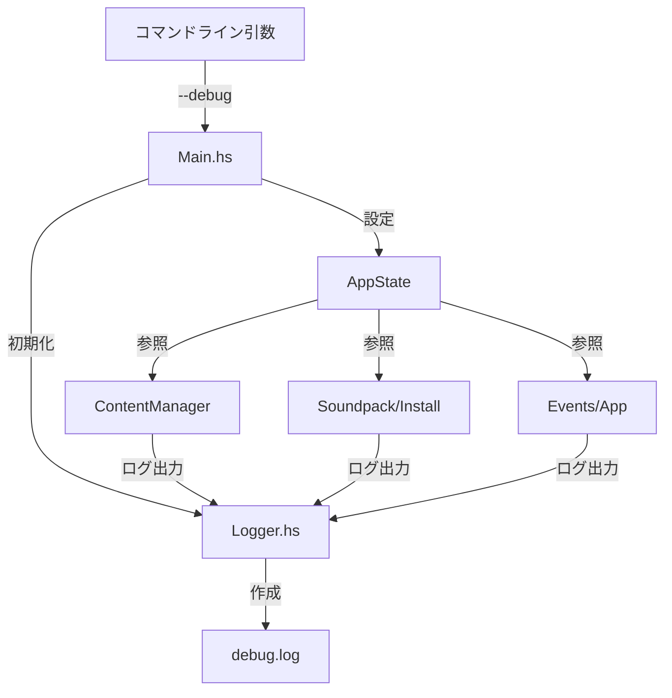

# デバッグログ機能実装計画

## 概要

`--debug` オプションが指定された時だけ、デバッグメッセージをファイルに出力する機能を実装する。

## 要件

- `--debug` コマンドラインオプションでデバッグモードを有効にする
- ログファイル: `~/.local/share/cataclysm-launcher/debug.log`
- タイムスタンプ付きのログ形式
- katip ロギングライブラリを使用

## 現状分析

### デバッグメッセージの使用箇所

現在 `Debug.Trace.trace` が以下のファイルで使用されている：

1. **src/ContentManager.hs** - ダウンロードキャッシュ関連（約10箇所）
2. **src/Soundpack/Install.hs** - サウンドパックインストール関連（約3箇所）
3. **src/Events/App.hs** - ダウンロード進捗関連（約6箇所）

### 依存関係

- katip: 既に依存関係に存在
- optparse-applicative: 新規追加が必要

## アーキテクチャ



## 実装手順

### 1. 依存関係の追加

**package.yaml** に `optparse-applicative` を追加：

```yaml
dependencies:
  # ... 既存の依存関係
  - optparse-applicative
```

### 2. ロギングモジュールの作成

**src/Logger.hs** を新規作成：

```haskell
module Logger
    ( initLogger
    , LogEnv
    , logDebug
    , logInfo
    ) where

import Katip
import System.Directory
import System.FilePath

-- ログ環境を初期化
initLogger :: Bool -> IO (Maybe LogEnv)

-- デバッグログ出力
logDebug :: Maybe LogEnv -> String -> IO ()

-- 情報ログ出力
logInfo :: Maybe LogEnv -> String -> IO ()
```

### 3. コマンドライン引数のパーサー

**app/Cli.hs** を新規作成：

```haskell
module Cli
    ( Options(..)
    , parseOptions
    ) where

import Options.Applicative

data Options = Options
    { optDebug :: Bool
    }

parseOptions :: IO Options
```

### 4. AppState の拡張

**src/Types/UI.hs** に `appLogEnv` を追加：

```haskell
data AppState = AppState
    { -- ... 既存のフィールド
    , appLogEnv :: Maybe LogEnv  -- デバッグモード時のみ Just
    }
```

### 5. Main.hs の修正

- コマンドライン引数をパース
- デバッグモード時にロガーを初期化
- AppState に LogEnv を設定

### 6. 既存コードの修正

各モジュールで `trace` を `logDebug` に置き換え：

- **src/ContentManager.hs**: `trace msg action` → `logDebug logEnv msg >> action`
- **src/Soundpack/Install.hs**: 同上
- **src/Events/App.hs**: 同上

## ログ形式

katip のデフォルト形式を使用：

```
[2026-02-24 21:10:00][Debug][main] Download started: example.tar.gz
[2026-02-24 21:10:01][Debug][main] Cache hit: example.tar.gz
```

## エラーハンドリング

- ログファイルの作成に失敗した場合は、stderr にエラーメッセージを出力して続行
- デバッグモードでない場合は、ログ出力関数は何もしない

## テスト計画

1. `--debug` なしで実行 → ログファイルが作成されない
2. `--debug` ありで実行 → ログファイルが作成され、メッセージが記録される
3. ログファイルにタイムスタンプが含まれることを確認

## 変更ファイル一覧

| ファイル | 変更種別 |
|---------|---------|
| package.yaml | 修正 |
| src/Logger.hs | 新規作成 |
| app/Cli.hs | 新規作成 |
| src/Types/UI.hs | 修正 |
| app/Main.hs | 修正 |
| src/ContentManager.hs | 修正 |
| src/Soundpack/Install.hs | 修正 |
| src/Events/App.hs | 修正 |
