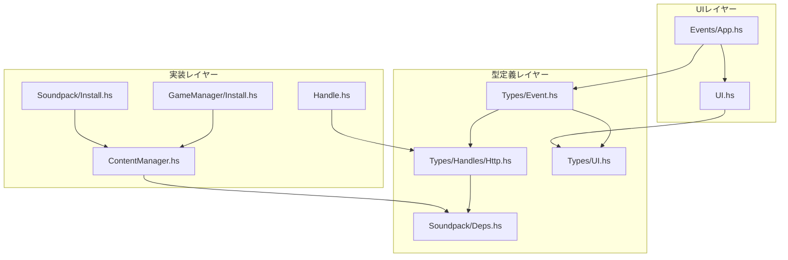
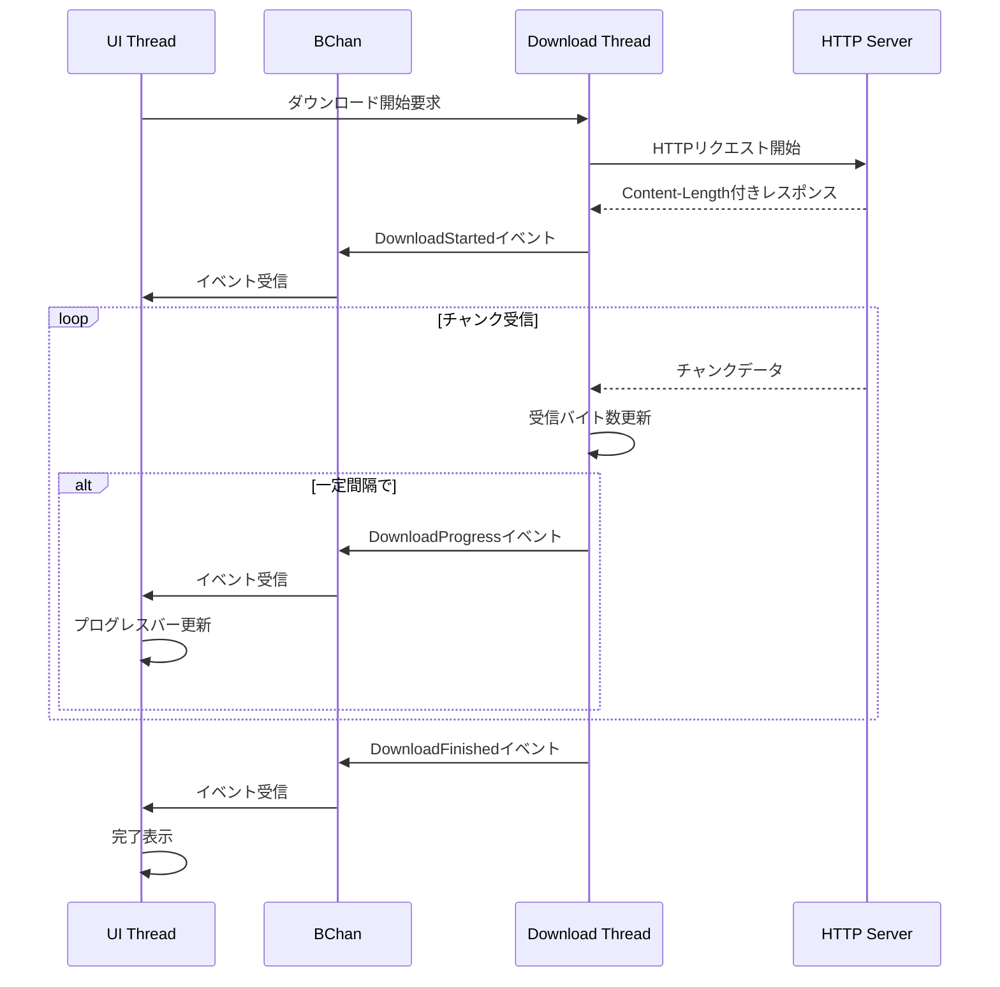

# ダウンロード進捗表示機能 実装計画

## 概要

Cataclysm DDA Launcherにダウンロード進捗表示機能を実装する。これにより、大きなファイル（ゲーム本体、サウンドパック等）のダウンロード時に、プログレスバー、ダウンロード速度、残り時間を表示できるようになる。

## 現状分析

### 現在のダウンロードフロー

```
[URL] -> httpLBS (一括ダウンロード) -> ByteString -> ファイル保存
```

**問題点:**
- ダウンロード完了まで進捗が表示されない
- 大きなファイル（数百MB〜GB）では長時間応答なし
- ユーザーがダウンロードが進行中かどうかを判断できない

### 関連ファイルと依存関係



### 変更が必要なファイル一覧

| ファイル | 役割 | 変更内容 | 優先度 |
|---------|------|----------|--------|
| `src/Types/Event.hs` | UIイベント定義 | `DownloadInfo`, `DownloadProgress` 型とイベントを追加 | 高 |
| `src/Types/Handles/Http.hs` | HTTPハンドル型定義 | `hDownloadWithProgress` 関数を追加 | 高 |
| `src/Soundpack/Deps.hs` | 依存性注入定義 | `ndDownloadWithProgress` を `NetworkDeps` に追加 | 高 |
| `src/Types/UI.hs` | UI状態定義 | `ActiveDownload` 型と `appDownloadProgress` フィールドを追加 | 高 |
| `src/Handle.hs` | ハンドル実装 | `downloadWithProgressImpl` を実装 | 高 |
| `src/ContentManager.hs` | ダウンロード処理 | 進捗コールバック対応に修正 | 中 |
| `src/GameManager/Install.hs` | ゲームインストール | 進捗イベント送信を追加 | 中 |
| `src/Soundpack/Install.hs` | サウンドパックインストール | 進捗イベント送信を追加 | 中 |
| `app/UI.hs` | UI描画 | プログレスバーウィジェットを追加 | 中 |
| `src/Events/App.hs` | イベント処理 | 進捗イベントハンドラを追加 | 中 |

## アーキテクチャ設計

### 新しいダウンロードフロー

```
[URL] -> HTTPストリーミング -> チャンク受信ごとにコールバック
                                    |
                                    v
                            進捗イベント生成
                                    |
                                    v
                            BChan経由でUIに通知
                                    |
                                    v
                            プログレスバー更新
```

### データフロー図



## 詳細設計

### 1. イベント型の拡張

**ファイル:** `src/Types/Event.hs`

**現在のコード（行10-45）:**
```haskell
data UIEvent
  = LogMessage T.Text
  | LogEvent T.Text
  | ErrorEvent T.Text
  | CacheHit T.Text
  | InstallFinished (Either ManagerError String)
  ...その他のイベント...
  deriving (Show, Eq)
```

**追加するコード:**
```haskell
-- UIEventの末尾（derivingの前）に追加
  | DownloadStarted DownloadInfo        -- ダウンロード開始
  | DownloadProgress DownloadProgress   -- 進捗更新
  | DownloadFinished T.Text             -- ダウンロード完了（ファイル名）
  | DownloadFailed T.Text ManagerError  -- ダウンロード失敗

-- 新規型定義（ファイルの最後に追加）
-- | ダウンロード開始時の情報
data DownloadInfo = DownloadInfo
    { diName :: T.Text          -- 表示名（ゲームバージョン、サウンドパック名等）
    , diFileName :: T.Text      -- ファイル名
    , diTotalBytes :: Int       -- 総バイト数（Content-Length）
    , diStartTime :: UTCTime    -- 開始時刻
    } deriving (Eq, Show)

-- | ダウンロード進捗情報
data DownloadProgress = DownloadProgress
    { dpFileName :: T.Text      -- ファイル名
    , dpDownloaded :: Int       -- ダウンロード済みバイト数
    , dpTotalBytes :: Int       -- 総バイト数
    } deriving (Eq, Show)
```

**必要なインポート追加:**
```haskell
import Data.Time (UTCTime)
```

### 2. HTTPハンドルの拡張

**ファイル:** `src/Types/Handles/Http.hs`

**現在のコード（行13-17）:**
```haskell
data HttpHandle m = HttpHandle
    { hDownloadAsset        :: T.Text -> m (Either ManagerError B.ByteString)
    , hDownloadFile         :: T.Text -> m (Either ManagerError L.ByteString)
    , hFetchReleasesFromAPI :: String -> Maybe UTCTime -> m (Either String L.ByteString)
    }
```

**変更後のコード:**
```haskell
data HttpHandle m = HttpHandle
    { hDownloadAsset        :: T.Text -> m (Either ManagerError B.ByteString)
    , hDownloadFile         :: T.Text -> m (Either ManagerError L.ByteString)
    , hFetchReleasesFromAPI :: String -> Maybe UTCTime -> m (Either String L.ByteString)
    -- 新規追加: 進捗コールバック付きダウンロード
    , hDownloadWithProgress :: T.Text 
                           -> (Int -> Int -> m ())  -- progress callback: downloaded, total
                           -> m (Either ManagerError B.ByteString)
    }
```

### 2.1 NetworkDepsの拡張

**ファイル:** `src/Soundpack/Deps.hs`

**現在のコード（行91-96）:**
```haskell
data NetworkDeps m = NetworkDeps
  { ndDownloadAsset :: T.Text -> m (Either ManagerError B.ByteString),
    ndDownloadFile :: T.Text -> m (Either ManagerError L.ByteString)
  }
```

**変更後のコード:**
```haskell
data NetworkDeps m = NetworkDeps
  { ndDownloadAsset :: T.Text -> m (Either ManagerError B.ByteString),
    ndDownloadFile :: T.Text -> m (Either ManagerError L.ByteString),
    -- 新規追加: 進捗コールバック付きダウンロード
    ndDownloadWithProgress :: T.Text 
                          -> (Int -> Int -> m ())  -- progress callback: downloaded, total
                          -> m (Either ManagerError B.ByteString)
  }
```

**toSoundpackDeps関数の修正（行151-157）:**
```haskell
-- 変更前
, spdNetwork = NetworkDeps
    { ndDownloadAsset = hDownloadAsset (appHttpHandle handle)
    , ndDownloadFile = hDownloadFile (appHttpHandle handle)
    }

-- 変更後
, spdNetwork = NetworkDeps
    { ndDownloadAsset = hDownloadAsset (appHttpHandle handle)
    , ndDownloadFile = hDownloadFile (appHttpHandle handle)
    , ndDownloadWithProgress = hDownloadWithProgress (appHttpHandle handle)
    }
```

### 3. UI状態の拡張

**ファイル:** `src/Types/UI.hs`

**現在のコード（行59-79）:**
```haskell
data AppState = AppState
    { appAvailableVersions :: List Name GameVersion
    , appInstalledVersions :: List Name InstalledVersion
    ...
    , appPendingOperations :: Set.Set PendingOperation
    }
```

**追加するコード:**
```haskell
-- AppStateの最後のフィールドとして追加
, appDownloadProgress :: Maybe ActiveDownload  -- 現在のダウンロード状態

-- 新規型定義（ファイルの末尾に追加）
-- | アクティブなダウンロードの状態
data ActiveDownload = ActiveDownload
    { adInfo :: DownloadInfo       -- ダウンロード情報
    , adDownloaded :: Int          -- ダウンロード済みバイト数
    , adLastUpdateTime :: UTCTime  -- 最終更新時刻
    , adSpeed :: Double            -- bytes per second
    } deriving (Eq, Show)
```

**必要なインポート追加:**
```haskell
import Data.Time (UTCTime)
import Types.Event (DownloadInfo)  -- Types.EventからDownloadInfoをインポート
```

### 4. ストリーミングダウンロード実装

**ファイル:** `src/Handle.hs`

**必要なインポート追加（ファイルの先頭付近）:**
```haskell
import Network.HTTP.Client
    ( parseRequest, withResponse, responseBody
    , responseHeaders, getResponseStatusCode
    , brRead, newManager, defaultManagerSettings
    , BodyReader
    )
import Network.HTTP.Types (hContentLength)
import Data.ByteString.Char8 (unpack)
import Control.Concurrent (threadDelay)
import Data.Time (diffUTCTime)
```

**liveHandleの修正（行96-117）:**
```haskell
-- 変更前
, appHttpHandle = HttpHandle
    { hDownloadAsset = \url -> liftIO $ do
        ...
    , hDownloadFile = \url -> do
        ...
    , hFetchReleasesFromAPI = \url msince -> liftIO $ do
        ...
    }

-- 変更後
, appHttpHandle = HttpHandle
    { hDownloadAsset = \url -> liftIO $ do
        ...
    , hDownloadFile = \url -> do
        ...
    , hFetchReleasesFromAPI = \url msince -> liftIO $ do
        ...
    -- 新規追加
    , hDownloadWithProgress = \url progressCallback -> liftIO $ 
        downloadWithProgressImpl url progressCallback
    }
```

**新規関数の実装（ファイルの末尾に追加）:**
```haskell
-- | HTTPストリーミングダウンロードを実行し、進捗をコールバックで通知する
downloadWithProgressImpl :: T.Text 
                         -> (Int -> Int -> IO ())  -- downloaded, total
                         -> IO (Either ManagerError B.ByteString)
downloadWithProgressImpl url progressCallback = do
    manager <- newManager defaultManagerSettings
    request <- parseRequest (T.unpack url)
    result <- try $ withResponse request manager $ \response -> do
        if getResponseStatusCode response /= 200
        then return $ Left $ NetworkError $ T.pack $ 
            "HTTP error: " ++ show (getResponseStatusCode response)
        else do
            let mContentLength = lookup hContentLength (responseHeaders response)
                totalBytes = maybe 0 (read . unpack) mContentLength
            chunks <- collectChunks (responseBody response) totalBytes 0 [] progressCallback
            return $ Right $ B.concat (reverse chunks)
    case result of
        Left (e :: SomeException) -> return $ Left $ NetworkError $ T.pack (show e)
        Right r -> return r

-- | レスポンスボディからチャンクを収集する
collectChunks :: BodyReader 
              -> Int           -- total bytes
              -> Int           -- downloaded so far
              -> [B.ByteString] -- accumulated chunks
              -> (Int -> Int -> IO ()) -- progress callback
              -> IO [B.ByteString]
collectChunks bodyReader totalBytes downloaded chunks callback = do
    chunk <- brRead bodyReader
    if B.null chunk
    then return chunks
    else do
        let newDownloaded = downloaded + B.length chunk
            newChunks = chunk : chunks
        -- 1MBごとまたは完了時にコールバック呼び出し
        when (newDownloaded - downloaded >= 1024 * 1024 || newDownloaded == totalBytes) $
            callback newDownloaded totalBytes
        collectChunks bodyReader totalBytes newDownloaded newChunks callback
```

**注意点:**
- `http-conduit` パッケージは既に依存関係に含まれている可能性がある
- 含まれていない場合は `package.yaml` に追加が必要
- `Network.HTTP.Simple` は `Network.HTTP.Client` のラッパーなので、低レベルAPIを使用

### 5. ContentManagerの修正

**ファイル:** `src/ContentManager.hs`

**現在の関数シグネチャ（行60-67）:**
```haskell
downloadWithCache :: MonadCatch m
                  => FileSystemDeps m
                  -> NetworkDeps m
                  -> FilePath      -- ^ Cache directory
                  -> T.Text        -- ^ URL
                  -> m ()          -- ^ Action to run on cache hit
                  -> m ()          -- ^ Action to run on cache miss
                  -> m (Either ManagerError FilePath)
```

**変更後の関数シグネチャ:**
```haskell
downloadWithCache :: MonadCatch m
                  => FileSystemDeps m
                  -> NetworkDeps m
                  -> FilePath      -- ^ Cache directory
                  -> T.Text        -- ^ URL
                  -> m ()          -- ^ Action to run on cache hit
                  -> m ()          -- ^ Action to run on cache miss
                  -> (Int -> Int -> m ())  -- ^ Progress callback: downloaded, total
                  -> m (Either ManagerError FilePath)
```

**関数本体の修正（行68-103）:**
```haskell
downloadWithCache fs net cacheDir url onCacheHit onCacheMiss onProgress = do
    let fileName = takeFileName (T.unpack url)
    let cacheFilePath = cacheDir </> fileName

    fsdCreateDirectoryIfMissing fs True cacheDir

    -- First check: Quick path for already cached files
    cacheExists <- fsdDoesFileExist fs cacheFilePath
    if cacheExists
    then do
        onCacheHit
        return $ Right cacheFilePath
    else do
        -- Try to acquire lock for downloading
        lockAcquired <- fsdTryAcquireFileLock fs cacheFilePath
        if not lockAcquired
        then do
            waitForDownload fs cacheFilePath onCacheHit
        else do
            -- We have the lock, check again
            cacheExistsAfterLock <- fsdDoesFileExist fs cacheFilePath
            if cacheExistsAfterLock
            then do
                fsdReleaseFileLock fs cacheFilePath
                onCacheHit
                return $ Right cacheFilePath
            else do
                -- Perform the actual download with progress
                onCacheMiss
                result <- doDownloadWithProgress fs net cacheFilePath url onProgress
                fsdReleaseFileLock fs cacheFilePath
                return result

-- 新規関数: 進捗付きダウンロード実行
doDownloadWithProgress :: MonadCatch m 
                       => FileSystemDeps m 
                       -> NetworkDeps m 
                       -> FilePath 
                       -> T.Text 
                       -> (Int -> Int -> m ())
                       -> m (Either ManagerError FilePath)
doDownloadWithProgress fs net cacheFilePath url onProgress = do
    result <- ndDownloadWithProgress net url onProgress
    case result of
        Left e -> return $ Left e
        Right responseBody -> do
            writeResult <- try $ fsdWriteFile fs cacheFilePath responseBody
            case writeResult of
                Left (e :: SomeException) -> return $ Left $ FileSystemError $ T.pack $ show e
                Right () -> return $ Right cacheFilePath
```

### 6. GameManager/Install.hsの修正

**ファイル:** `src/GameManager/Install.hs`

**現在のコード（行21-46）:**
```haskell
downloadAndInstall :: (MonadCatch m) => AppHandle m -> PathsConfig -> BChan UIEvent -> GameVersion -> m (Either ManagerError String)
downloadAndInstall handle pathsConfig eventChan gv = do
    ...
    let onCacheHit = hWriteBChan (appAsyncHandle handle) eventChan $ CacheHit ("Using cached file: " <> T.pack fileName)
    let onCacheMiss = hWriteBChan (appAsyncHandle handle) eventChan $ LogMessage ("Downloading: " <> T.pack fileName)
    ...
    assetDataEither <- downloadWithCache fsDeps netDeps cacheDir url onCacheHit onCacheMiss
    ...
```

**変更後のコード:**
```haskell
downloadAndInstall :: (MonadCatch m) => AppHandle m -> PathsConfig -> BChan UIEvent -> GameVersion -> m (Either ManagerError String)
downloadAndInstall handle pathsConfig eventChan gv = do
    let baseDir = T.unpack $ sysRepo pathsConfig
        installDir = baseDir </> "game" </> T.unpack (gvVersionId gv)
        cacheDir = T.unpack $ downloadCache pathsConfig
        displayName = gvVersionId gv

    setupResult <- setupDirectories handle installDir cacheDir
    case setupResult of
        Left err -> return $ Left err
        Right () -> do
            let url = gvUrl gv
            let fileName = takeFileName (T.unpack url)
            
            -- ダウンロード開始イベントを送信
            startTime <- hGetCurrentTime (appTimeHandle handle)
            let downloadInfo = DownloadInfo
                    { diName = displayName
                    , diFileName = T.pack fileName
                    , diTotalBytes = 0  -- 初期値、実際はHTTPヘッダーから取得
                    , diStartTime = startTime
                    }
            hWriteBChan (appAsyncHandle handle) eventChan $ DownloadStarted downloadInfo

            let onCacheHit = hWriteBChan (appAsyncHandle handle) eventChan $ CacheHit ("Using cached file: " <> T.pack fileName)
            let onCacheMiss = hWriteBChan (appAsyncHandle handle) eventChan $ LogMessage ("Downloading: " <> T.pack fileName)
            
            -- 進捗コールバック
            let onProgress downloaded total = do
                    let progress = DownloadProgress
                            { dpFileName = T.pack fileName
                            , dpDownloaded = downloaded
                            , dpTotalBytes = total
                            }
                    hWriteBChan (appAsyncHandle handle) eventChan $ DownloadProgress progress

            let fsDeps = toFileSystemDeps (appFileSystemHandle handle)
            let netDeps = NetworkDeps
                  { ndDownloadAsset = hDownloadAsset (appHttpHandle handle)
                  , ndDownloadFile = hDownloadFile (appHttpHandle handle)
                  , ndDownloadWithProgress = hDownloadWithProgress (appHttpHandle handle)
                  }

            assetDataEither <- downloadWithCache fsDeps netDeps cacheDir url onCacheHit onCacheMiss onProgress
            
            case assetDataEither of
                Left err -> do
                    hWriteBChan (appAsyncHandle handle) eventChan $ DownloadFailed (T.pack fileName) err
                    return $ Left err
                Right cacheFilePath -> do
                    hWriteBChan (appAsyncHandle handle) eventChan $ DownloadFinished (T.pack fileName)
                    extractArchive handle installDir cacheFilePath (gvUrl gv)
```

**必要なインポート追加:**
```haskell
import Types.Event (UIEvent(..), DownloadInfo(..), DownloadProgress(..))
import Soundpack.Deps (NetworkDeps(..))
```

### 7. Soundpack/Install.hsの修正

**ファイル:** `src/Soundpack/Install.hs`

**現在のコード（行83-102）:**
```haskell
zipDataResult <-
    if shouldUseCache
      then do
        let fileName = takeFileName (T.unpack downloadUrl)
        let onCacheHit = edWriteEvent events $ CacheHit ("Using cached soundpack: " <> T.pack fileName)
        let onCacheMiss = edWriteEvent events $ LogMessage ("Downloading soundpack: " <> T.pack fileName)

        cachePathEither <- downloadWithCache fs net cacheDir downloadUrl onCacheHit onCacheMiss
        ...
```

**変更後のコード:**
```haskell
zipDataResult <-
    if shouldUseCache
      then do
        let fileName = takeFileName (T.unpack downloadUrl)
        
        -- ダウンロード開始イベントを送信
        startTime <- tdGetCurrentTime time
        let downloadInfo = DownloadInfo
                { diName = spiRepoName soundpackInfo
                , diFileName = T.pack fileName
                , diTotalBytes = 0
                , diStartTime = startTime
                }
        edWriteEvent events $ DownloadStarted downloadInfo

        let onCacheHit = edWriteEvent events $ CacheHit ("Using cached soundpack: " <> T.pack fileName)
        let onCacheMiss = edWriteEvent events $ LogMessage ("Downloading soundpack: " <> T.pack fileName)
        
        -- 進捗コールバック
        let onProgress downloaded total = do
                let progress = DownloadProgress
                        { dpFileName = T.pack fileName
                        , dpDownloaded = downloaded
                        , dpTotalBytes = total
                        }
                edWriteEvent events $ DownloadProgress progress

        cachePathEither <- downloadWithCache fs net cacheDir downloadUrl onCacheHit onCacheMiss onProgress
        case cachePathEither of
          Left err -> do
            edWriteEvent events $ DownloadFailed (T.pack fileName) err
            return $ Left err
          Right path -> do
            edWriteEvent events $ DownloadFinished (T.pack fileName)
            content <- fsdReadFile fs path
            return $ Right content
      else do
        -- キャッシュなしの場合も同様に進捗通知を追加
        let fileName = takeFileName (T.unpack downloadUrl)
        edWriteEvent events $ LogMessage ("Downloading soundpack: " <> T.pack fileName)
        result <- ndDownloadAsset net downloadUrl
        return $ case result of
          Left err -> Left $ SoundpackManagerError $ SoundpackDownloadFailed $ T.pack $ show err
          Right content -> Right content
```

**必要なインポート追加:**
```haskell
import Types.Event (UIEvent(..), DownloadInfo(..), DownloadProgress(..))
```

### 8. UI表示の実装

**ファイル:** `app/UI.hs`

**プログレスバーウィジェットの追加:**
```haskell
-- 新規インポート
import Types.Event (DownloadInfo(..), DownloadProgress(..))
import Types.UI (ActiveDownload(..))

-- | ダウンロード進捗を表示するウィジェット
renderDownloadProgress :: ActiveDownload -> Widget Name
renderDownloadProgress ad =
    let total = diTotalBytes (adInfo ad)
        downloaded = adDownloaded ad
        percentage = if total > 0 then (downloaded * 100) `div` total else 0
        barWidth = 30
        filled = (percentage * barWidth) `div` 100
        empty = barWidth - filled
        bar = replicate filled '█' ++ replicate empty '░'
        speed = adSpeed ad
        remaining = if speed > 0 
                    then Just $ fromIntegral (total - downloaded) / speed
                    else Nothing
    in vBox
        [ str $ "Downloading: " ++ T.unpack (diName (adInfo ad))
        , hBox
            [ str $ "[" ++ bar ++ "] "
            , str $ show percentage ++ "%"
            ]
        , hBox
            [ str $ formatBytes downloaded ++ " / " ++ formatBytes total
            , str " | "
            , str $ formatSpeed speed
            , case remaining of
                Just secs -> str $ " | ETA: " ++ formatTime secs
                Nothing -> str ""
            ]
        ]

-- | バイト数を人間が読みやすい形式に変換
formatBytes :: Int -> String
formatBytes n
    | n >= 1024 * 1024 * 1024 = show (n `div` (1024 * 1024 * 1024)) ++ " GB"
    | n >= 1024 * 1024 = show (n `div` (1024 * 1024)) ++ " MB"
    | n >= 1024 = show (n `div` 1024) ++ " KB"
    | otherwise = show n ++ " B"

-- | 速度を人間が読みやすい形式に変換
formatSpeed :: Double -> String
formatSpeed bytesPerSec = formatBytes (round bytesPerSec) ++ "/s"

-- | 時間を人間が読みやすい形式に変換
formatTime :: Double -> String
formatTime secs
    | secs >= 3600 = show (round secs `div` 3600) ++ "h " ++ show ((round secs `mod` 3600) `div` 60) ++ "m"
    | secs >= 60 = show (round secs `div` 60) ++ "m " ++ show (round secs `mod` 60) ++ "s"
    | otherwise = show (round secs) ++ "s"
```

**drawUI関数の修正:**
```haskell
-- 既存のdrawUI関数に、ダウンロード進捗表示を追加
-- ステータスバーの上または別のレイヤーとして表示
drawUI s = [...existing layers..., maybe emptyWidget renderDownloadProgress (appDownloadProgress s)]
```

### 9. イベント処理の実装

**ファイル:** `src/Events/App.hs`

**handleAppEvent関数に追加:**
```haskell
-- 必要なインポート
import Data.Time (getCurrentTime, diffUTCTime)
import Types.Event (DownloadInfo(..), DownloadProgress(..))
import Types.UI (ActiveDownload(..))

-- handleAppEvent関数のcase文に追加
handleAppEvent :: AppState -> UIEvent -> EventM Name (Next AppState)
handleAppEvent s event = case event of
    ...existing cases...
    
    DownloadStarted info -> do
        let ad = ActiveDownload
                { adInfo = info
                , adDownloaded = 0
                , adLastUpdateTime = diStartTime info
                , adSpeed = 0
                }
        continue s { appDownloadProgress = Just ad
                   , appStatus = "Downloading " <> diName info <> "..."
                   }
    
    DownloadProgress dp -> do
        case appDownloadProgress s of
            Nothing -> continue s
            Just ad -> do
                now <- liftIO getCurrentTime
                let elapsed = diffUTCTime now (adLastUpdateTime ad)
                    bytesDiff = dpDownloaded dp - adDownloaded ad
                    newSpeed = if elapsed > 0 
                               then fromIntegral bytesDiff / realToFrac elapsed
                               else adSpeed ad
                    -- 移動平均を使用して速度をスムーズに
                    smoothedSpeed = (adSpeed ad * 0.7) + (newSpeed * 0.3)
                    updatedAd = ad { adDownloaded = dpDownloaded dp
                                   , adLastUpdateTime = now
                                   , adSpeed = smoothedSpeed
                                   }
                continue s { appDownloadProgress = Just updatedAd }
    
    DownloadFinished name -> do
        continue s { appDownloadProgress = Nothing
                   , appStatus = "Download complete: " <> name
                   }
    
    DownloadFailed name err -> do
        continue s { appDownloadProgress = Nothing
                   , appStatus = "Download failed: " <> name <> " - " <> T.pack (show err)
                   }
```

## 実装ステップ

### フェーズ1: 型定義とイベント追加（必須）

1. **`src/Types/Event.hs`** に以下を追加:
   - `DownloadInfo` 型定義
   - `DownloadProgress` 型定義
   - `DownloadStarted`, `DownloadProgress`, `DownloadFinished`, `DownloadFailed` イベント
   - `Data.Time (UTCTime)` のインポート

2. **`src/Types/Handles/Http.hs`** に以下を追加:
   - `hDownloadWithProgress` フィールド

3. **`src/Soundpack/Deps.hs`** に以下を追加:
   - `NetworkDeps` に `ndDownloadWithProgress` フィールド
   - `toSoundpackDeps` 関数の修正

4. **`src/Types/UI.hs`** に以下を追加:
   - `ActiveDownload` 型定義
   - `AppState` に `appDownloadProgress` フィールド
   - 必要なインポート

### フェーズ2: HTTPストリーミング実装（必須）

5. **`src/Handle.hs`** に以下を追加:
   - 必要なインポート（`Network.HTTP.Client`, `Data.ByteString.Char8`）
   - `downloadWithProgressImpl` 関数
   - `collectChunks` 関数
   - `liveHandle` の `appHttpHandle` に `hDownloadWithProgress` を追加

### フェーズ3: ダウンロード処理の修正（必須）

6. **`src/ContentManager.hs`** を修正:
   - `downloadWithCache` 関数に進捗コールバック引数を追加
   - `doDownloadWithProgress` 関数を追加

7. **`src/GameManager/Install.hs`** を修正:
   - `downloadAndInstall` 関数で進捗イベントを送信
   - `downloadWithCache` 呼び出しに進捗コールバックを追加

8. **`src/Soundpack/Install.hs`** を修正:
   - `installSoundpack` 関数で進捗イベントを送信
   - `downloadWithCache` 呼び出しに進捗コールバックを追加

### フェーズ4: UI実装（必須）

9. **`app/UI.hs`** に追加:
   - `renderDownloadProgress` ウィジェット
   - `formatBytes`, `formatSpeed`, `formatTime` ヘルパー関数
   - `drawUI` でプログレスバーを表示

10. **`src/Events/App.hs`** に追加:
    - `DownloadStarted` イベントハンドラ
    - `DownloadProgress` イベントハンドラ
    - `DownloadFinished` イベントハンドラ
    - `DownloadFailed` イベントハンドラ

### フェーズ5: テスト（推奨）

11. **`test/HandleSpec.hs`** に追加:
    - `hDownloadWithProgress` のモックテスト

12. **`test/Events/AppSpec.hs`** に追加:
    - 進捗イベント処理のテスト

13. **`test/ContentManagerSpec.hs`** に追加:
    - 進捗コールバック付きダウンロードのテスト

## テスト計画

### ユニットテスト

| テストケース | 対象 | 内容 |
|-------------|------|------|
| 進捗イベント生成 | `Handle.hs` | チャンク受信時にコールバックが呼ばれる |
| 進捗計算 | `Events/App.hs` | 速度と残り時間が正しく計算される |
| プログレスバー描画 | `UI.hs` | パーセンテージが正しく表示される |
| Content-Length解析 | `Handle.hs` | HTTPヘッダーから正しくサイズを取得 |

### モックテスト

**test/HandleSpec.hs に追加:**
```haskell
describe "hDownloadWithProgress" $ do
    it "calls progress callback with correct values" $ do
        -- モックHTTPサーバーまたはモックハンドルを使用
        -- 進捗コールバックが正しい引数で呼ばれることを確認
        pending
```

**test/Events/AppSpec.hs に追加:**
```haskell
describe "DownloadProgress events" $ do
    it "updates AppState on DownloadStarted" $ do
        let info = DownloadInfo "test" "test.zip" 1000 someTime
            event = DownloadStarted info
        -- handleAppEventを呼び出して状態を確認
        pending
    
    it "calculates speed correctly on DownloadProgress" $ do
        -- 速度計算が正しいことを確認
        pending
```

### 統合テスト

| テストケース | 内容 |
|-------------|------|
| 小ファイルダウンロード | 進捗イベントが適切に生成される |
| 大ファイルダウンロード | プログレスバーが更新される |
| Content-Lengthなし | 総バイト数0でも動作する |
| ネットワークエラー | エラーイベントが生成される |
| キャッシュヒット | 進捗表示なしで即座に完了 |

## リスクと対策

| リスク | 影響 | 対策 |
|-------|------|------|
| Content-Length ヘッダーなし | パーセンテージ表示不可 | ダウンロード済みバイト数のみ表示 |
| 高頻度イベント | UIパフォーマンス低下 | イベント送信間隔を制限（1MBごと） |
| 並行ダウンロード | 競合状態 | 既存のファイルロック機構を維持 |
| 接続中断 | 不完全なファイル | キャッシュファイルの削除処理 |
| 速度変動 | ETAが不正確 | 移動平均で速度をスムーズ化 |

## 依存関係

### 既存の依存関係で対応可能
- `http-client` / `http-conduit`: ストリーミングダウンロード（既に使用中）
- `brick`: UI描画
- `bytestring`: データ処理
- `time`: 時間計算

### 新しい依存関係の追加は不要

## 成功基準

1. ダウンロード中にプログレスバーが表示される
2. ダウンロード速度が表示される
3. 残り時間が推定表示される
4. キャッシュヒット時は即座に完了表示
5. エラー時に適切なメッセージが表示される
6. 並行ダウンロードが正しく処理される

## 実装チェックリスト

新しいチャットで実装する際は、以下の順序で進めてください：

### チェックリスト

- [ ] **フェーズ1: 型定義**
  - [ ] `src/Types/Event.hs` に `DownloadInfo`, `DownloadProgress` 型を追加
  - [ ] `src/Types/Event.hs` に4つのイベントを追加
  - [ ] `src/Types/Handles/Http.hs` に `hDownloadWithProgress` を追加
  - [ ] `src/Soundpack/Deps.hs` の `NetworkDeps` を修正
  - [ ] `src/Types/UI.hs` に `ActiveDownload` 型を追加
  - [ ] `src/Types/UI.hs` の `AppState` に `appDownloadProgress` を追加

- [ ] **フェーズ2: HTTP実装**
  - [ ] `src/Handle.hs` にインポートを追加
  - [ ] `src/Handle.hs` に `downloadWithProgressImpl` を実装
  - [ ] `src/Handle.hs` に `collectChunks` を実装
  - [ ] `src/Handle.hs` の `liveHandle` を修正

- [ ] **フェーズ3: ダウンロード処理**
  - [ ] `src/ContentManager.hs` の `downloadWithCache` を修正
  - [ ] `src/GameManager/Install.hs` を修正
  - [ ] `src/Soundpack/Install.hs` を修正

- [ ] **フェーズ4: UI**
  - [ ] `app/UI.hs` にウィジェットを追加
  - [ ] `src/Events/App.hs` にイベントハンドラを追加

- [ ] **フェーズ5: テスト**
  - [ ] ユニットテストを追加
  - [ ] 統合テストを実行

- [ ] **ビルド確認**
  - [ ] `stack build` が成功すること
  - [ ] `stack test` が成功すること

## 注意事項

### 新しいチャットで実装する際の重要な情報

1. **プロジェクト構造**: このプロジェクトはHaskell/Brick TUIアプリケーションです
2. **ビルドシステム**: `stack` を使用
3. **依存性注入**: Handle パターンを使用（`AppHandle`, `HttpHandle`, `FileSystemHandle` 等）
4. **イベント処理**: `Brick.BChan` を使用して非同期イベントを処理

### コンパイルエラーへの対処

実装中にコンパイルエラーが発生した場合：
1. まず型定義（フェーズ1）を完了させる
2. 次に実装（フェーズ2-4）を進める
3. 各ファイルの変更後、`stack build` で確認

### 既存のテストへの影響

- `ContentManager` の関数シグネチャ変更により、既存のテストも修正が必要
- モックハンドルの定義に `hDownloadWithProgress` を追加する必要がある
