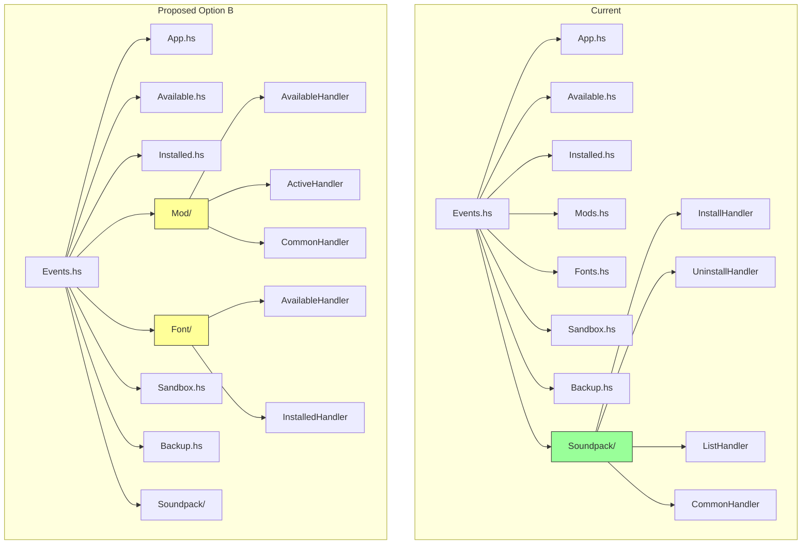

# Event Handler Organization Analysis

## Overview

This document provides a detailed analysis of the current event handler organization in the Cataclysm Launcher Brick project, comparing the well-organized Soundpack handlers with other handlers, and presents recommendations for potential reorganization.

---

## Current Structure

### Soundpack Handlers (Well-Organized)

```
src/Events/Soundpack/
├── CommonHandler.hs      (90 lines)  - Shared utility functions
├── InstallHandler.hs     (45 lines)  - Installation event handling
├── ListHandler.hs        (51 lines)  - List refresh operations
└── UninstallHandler.hs   (45 lines)  - Uninstallation event handling

src/Events/Soundpack.hs   (9 lines)   - Re-export module
```

**Characteristics:**
- Each handler has a single responsibility
- Common utilities extracted to `CommonHandler.hs`
- Comprehensive documentation headers with module description, copyright, and usage examples
- Re-export module provides clean public API
- Functions like `withSelectedSoundpack` and `withSelectedItems` reduce boilerplate

### Other Handlers (Flat Structure)

```
src/Events/
├── App.hs         (162 lines) - Central event hub, handles UIEvent dispatching
├── Available.hs   (33 lines)  - Available game versions list
├── Backup.hs      (13 lines)  - Backup list handling
├── Fonts.hs       (36 lines)  - Font handlers (available + installed)
├── Installed.hs   (37 lines)  - Installed game versions list
├── List.hs        (31 lines)  - Generic list movement utilities
├── Mods.hs        (117 lines) - Mod handlers (available + active)
└── Sandbox.hs     (72 lines)  - Sandbox profile handling

src/Events.hs      (70 lines)  - Main event router
```

---

## Detailed Analysis by Handler

### 1. App.hs - Central Hub

**Current Role:**
- Handles `UIEvent` dispatching via `handleAppEvent` and `handleAppEventPure`
- Contains `modHandlerErrorToText` function (should be in `Types.Error`)
- Orchestrates IO operations and state updates

**Complexity:** High - handles 15+ different event types

**Potential Improvement:**
- Split into sub-handlers for different event categories
- Extract error conversion functions to appropriate modules

### 2. Mods.hs - Dual Responsibility

**Current Role:**
- `handleAvailableModEvents` - Available mods list events
- `handleActiveModEvents` - Active mods list events
- `refreshAvailableModsList` / `refreshActiveModsList` - List refresh
- `getInstallModAction` / `getEnableModAction` / `getDisableModAction` - Action generators

**Complexity:** Medium-High - 117 lines with multiple responsibilities

**Comparison with Soundpack:**
- Soundpack has separate `InstallHandler`, `ListHandler`, `UninstallHandler`
- Mods combines all these in one file

**Potential Improvement:**
```
src/Events/Mod/
├── CommonHandler.hs     - Shared utilities (getInstallModAction, etc.)
├── AvailableHandler.hs  - handleAvailableModEvents, refreshAvailableModsList
├── ActiveHandler.hs     - handleActiveModEvents, refreshActiveModsList
└── Actions.hs           - Action generators (getInstallModAction, etc.)
```

### 3. Fonts.hs - Dual Responsibility

**Current Role:**
- `handleAvailableFontEvents` - Available fonts list events
- `handleInstalledFontEvents` - Installed fonts list events

**Complexity:** Low - 36 lines, simple delegation

**Potential Improvement:**
```
src/Events/Font/
├── CommonHandler.hs     - Shared utilities (if needed)
├── AvailableHandler.hs  - handleAvailableFontEvents
└── InstalledHandler.hs  - handleInstalledFontEvents
```

### 4. Available.hs / Installed.hs - Game Version Handlers

**Current Role:**
- `Available.hs`: Available game versions download handling
- `Installed.hs`: Installed game versions launch handling

**Complexity:** Low - Single responsibility each

**Potential Improvement:**
```
src/Events/Game/
├── AvailableHandler.hs  - handleAvailableEvents, getDownloadAction
├── InstalledHandler.hs  - handleInstalledEvents, getLaunchAction
└── CommonHandler.hs     - Shared game-related utilities (if needed)
```

### 5. Sandbox.hs - Single Responsibility

**Current Role:**
- `handleSandboxProfileEvents` - Profile selection and creation
- `decideNewProfileName` / `shouldBackupProfile` - Pure helper functions
- `createProfile` / `backupProfile` - IO actions

**Complexity:** Medium - 72 lines

**Potential Improvement:**
```
src/Events/Sandbox/
├── ProfileHandler.hs    - handleSandboxProfileEvents
├── Actions.hs           - createProfile, backupProfile
└── Pure.hs              - decideNewProfileName, shouldBackupProfile
```

### 6. Backup.hs - Minimal Handler

**Current Role:**
- `handleBackupEvents` / `handleBackupEvents'` - Simple list delegation

**Complexity:** Very Low - 13 lines

**Recommendation:** Keep as-is or merge with Sandbox handlers

### 7. List.hs - Utility Module

**Current Role:**
- `handleListEvents` / `handleListEvents'` - Generic list movement
- `handleListMove` - State update for list movement

**Complexity:** Low - 31 lines

**Recommendation:** Keep as-is, this is a shared utility module

---

## Comparison: Soundpack vs Other Handlers

| Aspect | Soundpack | Mods | Fonts | Game |
|--------|-----------|------|-------|------|
| Directory Structure | Subdirectory | Flat | Flat | Flat |
| Single Responsibility | Yes | No | No | Yes |
| Common Utilities | Extracted | Inline | N/A | N/A |
| Documentation | Comprehensive | Minimal | Minimal | Minimal |
| Re-export Module | Yes | N/A | N/A | N/A |
| Lines of Code | 231 total | 117 | 36 | 70 |

---

## Reorganization Options

### Option A: Full Reorganization

Create subdirectories for all handler categories:

```
src/Events/
├── App.hs                    - Central hub (simplified)
├── List.hs                   - Shared utilities
├── Events.hs                 - Main router
├── Game/
│   ├── CommonHandler.hs
│   ├── AvailableHandler.hs
│   └── InstalledHandler.hs
├── Mod/
│   ├── CommonHandler.hs
│   ├── AvailableHandler.hs
│   └── ActiveHandler.hs
├── Font/
│   ├── CommonHandler.hs
│   ├── AvailableHandler.hs
│   └── InstalledHandler.hs
├── Sandbox/
│   ├── CommonHandler.hs
│   └── ProfileHandler.hs
└── Soundpack/                - Already organized
    └── ...
```

**Pros:**
- Consistent structure across all handlers
- Easier to locate specific functionality
- Better scalability for future additions

**Cons:**
- More files to maintain
- May be over-engineering for simple handlers like Backup
- Requires updating all imports

### Option B: Partial Reorganization

Only split handlers with multiple responsibilities:

```
src/Events/
├── App.hs
├── Available.hs              - Keep as-is
├── Backup.hs                 - Keep as-is
├── Installed.hs              - Keep as-is
├── List.hs
├── Sandbox.hs
├── Mod/                      - Split into subdirectory
│   ├── CommonHandler.hs
│   ├── AvailableHandler.hs
│   └── ActiveHandler.hs
├── Font/                     - Split into subdirectory
│   ├── AvailableHandler.hs
│   └── InstalledHandler.hs
└── Soundpack/                - Already organized
```

**Pros:**
- Addresses the most complex handlers first
- Less disruptive than full reorganization
- Demonstrates pattern before wider adoption

**Cons:**
- Inconsistent structure (some flat, some subdirectories)
- May need to revisit later

### Option C: Documentation Only

Keep current structure but add documentation:

- Add module headers to all handlers
- Add function documentation
- Create a README in `src/Events/` explaining the organization

**Pros:**
- Minimal code changes
- Immediate improvement in code readability
- No import updates needed

**Cons:**
- Does not address structural issues
- Mods.hs and Fonts.hs remain with dual responsibilities

---

## Recommendations

### High Priority
1. Add documentation headers to all event handler modules
2. Extract `modHandlerErrorToText` from `Events.App` to `Types.Error`

### Medium Priority
3. Consider splitting `Mods.hs` into subdirectory (largest file with multiple responsibilities)
4. Consider splitting `Fonts.hs` into subdirectory for consistency

### Low Priority
5. Consider full reorganization if the codebase grows significantly
6. Create `Events.Game/` subdirectory for consistency with Soundpack pattern

---

## Diagram: Current vs Proposed Structure



---

## Next Steps

1. Review this analysis with the team
2. Decide on reorganization approach (A, B, or C)
3. Create implementation plan for chosen approach
4. Execute changes incrementally with tests