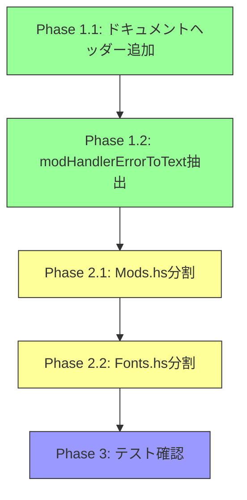

# Event Handler Refactoring Implementation Plan

## Overview

このドキュメントは `event_handler_organization_analysis.md` に基づいたリファクタリング実装計画です。
推奨事項に従い、高優先度から順に実施します。

---

## Phase 1: 高優先度タスク

### 1.1 ドキュメントヘッダーの追加

以下のモジュールに Soundpack/CommonHandler.hs と同様の形式でドキュメントヘッダーを追加します。

#### 対象ファイル

| ファイル | 現状 | 必要な作業 |
|---------|------|-----------|
| `src/Events/App.hs` | ヘッダーなし | モジュール説明、著作権、使用例を追加 |
| `src/Events/Available.hs` | ヘッダーなし | モジュール説明、著作権を追加 |
| `src/Events/Installed.hs` | ヘッダーなし | モジュール説明、著作権を追加 |
| `src/Events/Mods.hs` | ヘッダーなし | モジュール説明、著作権を追加 |
| `src/Events/Fonts.hs` | ヘッダーなし | モジュール説明、著作権を追加 |
| `src/Events/Sandbox.hs` | ヘッダーなし | モジュール説明、著作権を追加 |
| `src/Events/Backup.hs` | ヘッダーなし | モジュール説明、著作権を追加 |
| `src/Events/List.hs` | ヘッダーなし | モジュール説明、著作権を追加 |

#### ドキュメントヘッダーのテンプレート

```haskell
{-|
Module      : Events.Xxx
Description : [モジュールの簡潔な説明]
Copyright   : (c) 2023-2024 The Cataclysm-Launcher-Brick Team
License     : MIT
Maintainer  : Tlsh
Stability   : experimental
Portability : POSIX

[モジュールの詳細な説明]
-}
```

### 1.2 modHandlerErrorToText の Types.Error への抽出

#### 現状

- `ModHandlerError` 型は `Types.Domain` で定義されている
- `modHandlerErrorToText` 関数は `Events.App` で定義されている

#### 変更内容

1. `src/Types/Error.hs` に `modHandlerErrorToText` を移動
2. `Types.Error` モジュールのエクスポートリストに追加
3. `Events.App` から関数定義を削除し、`Types.Error` からインポート

#### 変更後の Types.Error.hs

```haskell
module Types.Error (
    SoundpackError(..),
    ManagerError(..),
    managerErrorToText,
    ModHandlerError(..),      -- Types.Domain から移動
    modHandlerErrorToText     -- 新規追加
) where
```

**注意**: `ModHandlerError` 型自体は `Types.Domain` に残し、`modHandlerErrorToText` 関数のみを `Types.Error` に追加します。
これは `ModHandlerError` がドメイン型であり、他のドメイン型と一緒に定義されているためです。

---

## Phase 2: 中優先度タスク

### 2.1 Mods.hs のサブディレクトリ分割

#### 現在の構造

```
src/Events/Mods.hs (117行)
├── handleAvailableModEvents
├── handleActiveModEvents
├── refreshAvailableModsList
├── refreshActiveModsList
├── getInstallModAction
├── getEnableModAction
└── getDisableModAction
```

#### 新しい構造

```
src/Events/Mod/
├── CommonHandler.hs     - 共通ユーティリティ
├── AvailableHandler.hs  - Available mods 関連
├── ActiveHandler.hs     - Active mods 関連
└── Actions.hs           - アクション生成関数

src/Events/Mod.hs        - 再エクスポートモジュール
```

#### 各ファイルの内容

##### CommonHandler.hs

```haskell
module Events.Mod.CommonHandler where
-- 共通ユーティリティ（必要に応じて抽出）
```

##### AvailableHandler.hs

```haskell
module Events.Mod.AvailableHandler (
    handleAvailableModEvents,
    refreshAvailableModsList
) where
-- handleAvailableModEvents
-- refreshAvailableModsList
```

##### ActiveHandler.hs

```haskell
module Events.Mod.ActiveHandler (
    handleActiveModEvents,
    refreshActiveModsList
) where
-- handleActiveModEvents
-- refreshActiveModsList
```

##### Actions.hs

```haskell
module Events.Mod.Actions (
    getInstallModAction,
    getEnableModAction,
    getDisableModAction
) where
-- getInstallModAction
-- getEnableModAction
-- getDisableModAction
```

##### Mod.hs (再エクスポート)

```haskell
module Events.Mod (
    module Events.Mod.AvailableHandler,
    module Events.Mod.ActiveHandler,
    module Events.Mod.Actions
) where

import Events.Mod.AvailableHandler
import Events.Mod.ActiveHandler
import Events.Mod.Actions
```

#### インポートの更新

以下のファイルでインポートを更新:

- `src/Events.hs` - `Events.Mods` → `Events.Mod` に変更
- `src/Events/App.hs` - `Events.Mods` → `Events.Mod` に変更

### 2.2 Fonts.hs のサブディレクトリ分割

#### 現在の構造

```
src/Events/Fonts.hs (36行)
├── handleAvailableFontEvents
└── handleInstalledFontEvents
```

#### 新しい構造

```
src/Events/Font/
├── AvailableHandler.hs  - handleAvailableFontEvents
└── InstalledHandler.hs  - handleInstalledFontEvents

src/Events/Font.hs       - 再エクスポートモジュール
```

#### 各ファイルの内容

##### AvailableHandler.hs

```haskell
module Events.Font.AvailableHandler (
    handleAvailableFontEvents
) where
-- handleAvailableFontEvents
```

##### InstalledHandler.hs

```haskell
module Events.Font.InstalledHandler (
    handleInstalledFontEvents
) where
-- handleInstalledFontEvents
```

##### Font.hs (再エクスポート)

```haskell
module Events.Font (
    module Events.Font.AvailableHandler,
    module Events.Font.InstalledHandler
) where

import Events.Font.AvailableHandler
import Events.Font.InstalledHandler
```

#### インポートの更新

以下のファイルでインポートを更新:

- `src/Events.hs` - `Events.Fonts` → `Events.Font` に変更

---

## Phase 3: テスト確認

### テストファイルの更新

リファクタリングに伴い、以下のテストファイルを更新:

- `test/Events/ModsSpec.hs` → `test/Events/Mod/` に分割
- `test/Events/AppSpec.hs` - インポートの更新

### ビルド確認

```bash
stack build
stack test
```

---

## 実行順序



---

## ファイル変更一覧

### 新規作成ファイル

| ファイルパス | 説明 |
|-------------|------|
| `src/Events/Mod.hs` | 再エクスポートモジュール |
| `src/Events/Mod/CommonHandler.hs` | 共通ユーティリティ |
| `src/Events/Mod/AvailableHandler.hs` | Available mods ハンドラー |
| `src/Events/Mod/ActiveHandler.hs` | Active mods ハンドラー |
| `src/Events/Mod/Actions.hs` | アクション生成関数 |
| `src/Events/Font.hs` | 再エクスポートモジュール |
| `src/Events/Font/AvailableHandler.hs` | Available fonts ハンドラー |
| `src/Events/Font/InstalledHandler.hs` | Installed fonts ハンドラー |

### 変更ファイル

| ファイルパス | 変更内容 |
|-------------|---------|
| `src/Events/App.hs` | ドキュメント追加、modHandlerErrorToText削除 |
| `src/Events/Available.hs` | ドキュメント追加 |
| `src/Events/Installed.hs` | ドキュメント追加 |
| `src/Events/Backup.hs` | ドキュメント追加 |
| `src/Events/Sandbox.hs` | ドキュメント追加 |
| `src/Events/List.hs` | ドキュメント追加 |
| `src/Types/Error.hs` | modHandlerErrorToText追加 |
| `src/Events.hs` | インポートパス更新 |

### 削除ファイル

| ファイルパス | 理由 |
|-------------|------|
| `src/Events/Mods.hs` | Mod/ ディレクトリに分割 |
| `src/Events/Fonts.hs` | Font/ ディレクトリに分割 |

---

## 注意事項

1. **Cabalファイルの更新**: 新規ファイルを `cataclysm-launcher-brick-gemini.cabal` に追加
2. **インポートの整合性**: すべてのインポートが正しく解決されることを確認
3. **テストの実行**: 各フェーズ後にテストを実行して動作確認
