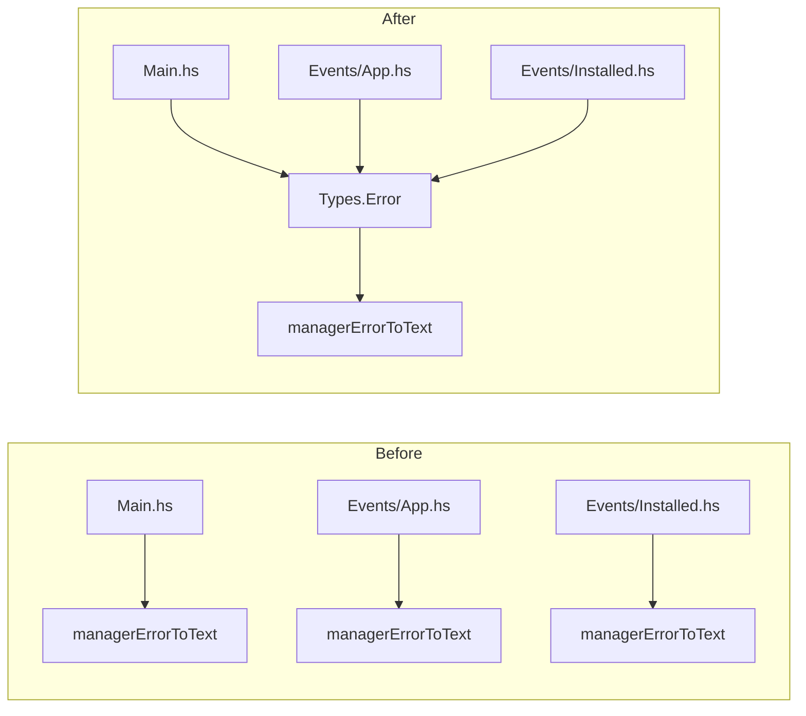

# `managerErrorToText` Function Refactoring Plan

## Overview

Remove duplicate `managerErrorToText` function definitions and consolidate into `Types.Error` module.

## Current State

The same function is defined in three places:

| File | Lines | Note |
|------|-------|------|
| [`app/Main.hs`](app/Main.hs:42) | 42-50 | `GeneralManagerError msg -> msg` |
| [`src/Events/App.hs`](src/Events/App.hs:182) | 182-190 | `GeneralManagerError msg -> msg` |
| [`src/Events/Installed.hs`](src/Events/Installed.hs:39) | 39-47 | `GeneralManagerError msg -> "Error: " <> msg` |

**Decision**: Adopt `Installed.hs` style with `"Error: "` prefix for consistency.

## Implementation Steps

### Step 1: Add function to Types.Error

**File**: [`src/Types/Error.hs`](src/Types/Error.hs)

Add the following function:

```haskell
-- | Convert ManagerError to user-friendly Text.
managerErrorToText :: ManagerError -> T.Text
managerErrorToText err = case err of
    NetworkError msg -> "Network Error: " <> msg
    FileSystemError msg -> "File System Error: " <> msg
    ArchiveError msg -> "Archive Error: " <> msg
    LaunchError msg -> "Launch Error: " <> msg
    GeneralManagerError msg -> "Error: " <> msg
    UnknownError msg -> "Unknown Error: " <> msg
    SoundpackManagerError e -> "Soundpack Error: " <> T.pack (show e)
```

Update exports:

```haskell
module Types.Error (
    SoundpackError(..),
    ManagerError(..),
    managerErrorToText  -- Add this
) where
```

### Step 2: Update Events/App.hs

**File**: [`src/Events/App.hs`](src/Events/App.hs)

1. Update import:
   ```haskell
   import Types.Error (ManagerError(..), managerErrorToText)
   ```

2. Remove lines 182-190 (the function definition)

3. Update module exports (line 3):
   ```haskell
   module Events.App (handleAppEvent, handleAppEventPure, modHandlerErrorToText) where
   -- Remove managerErrorToText from exports
   ```

### Step 3: Update Events/Installed.hs

**File**: [`src/Events/Installed.hs`](src/Events/Installed.hs)

1. Update import:
   ```haskell
   import Types.Error (ManagerError(..), managerErrorToText)
   ```

2. Remove lines 39-47 (the function definition)

### Step 4: Update Main.hs

**File**: [`app/Main.hs`](app/Main.hs)

1. Update import:
   ```haskell
   import Types.Error (ManagerError(..), managerErrorToText)
   ```

2. Remove lines 41-50 (the function definition and comment)

### Step 5: Verify build

Run `stack build` to ensure all changes compile correctly.

## Diagram



## Files Changed

| File | Action |
|------|--------|
| `src/Types/Error.hs` | Add function and export |
| `src/Events/App.hs` | Remove function, update import and export |
| `src/Events/Installed.hs` | Remove function, update import |
| `app/Main.hs` | Remove function, update import |

## Risk Assessment

- **Low Risk**: Simple function extraction
- **Testing**: Run `stack test` after changes
- **Rollback**: Easy to revert individual file changes