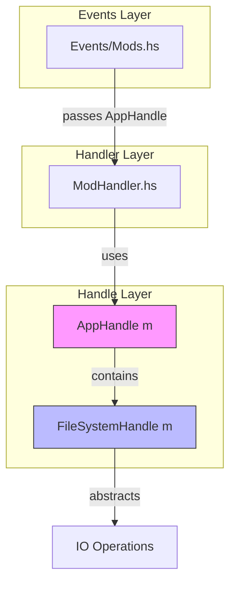

# ModHandler Handle Pattern Refactoring Plan

## Overview

[`src/ModHandler.hs`](src/ModHandler.hs) の `enableMod`, `disableMod`, `listAvailableMods`, `listActiveMods` 関数は直接 `IO` を使用しており、プロジェクトの依存性注入パターン（Handle Pattern）に従っていない。このリファクタリングでは、これらの関数を `AppHandle m` を使用するように変更する。

## Current State

### Problem Functions

| Function | Current Signature | Issue |
|----------|-------------------|-------|
| [`enableMod`](src/ModHandler.hs:44) | `FilePath -> ModInfo -> IO (Either ModHandlerError ())` | 直接 `IO` 使用 |
| [`disableMod`](src/ModHandler.hs:62) | `FilePath -> ModInfo -> IO (Either ModHandlerError ())` | 直接 `IO` 使用 |
| [`listAvailableMods`](src/ModHandler.hs:71) | `FilePath -> FilePath -> IO [ModInfo]` | 直接 `IO` 使用 |
| [`listActiveMods`](src/ModHandler.hs:78) | `FilePath -> IO [ModInfo]` | 直接 `IO` 使用 |
| [`findMods`](src/ModHandler.hs:92) | `FilePath -> IO [ModInfo]` | 直接 `IO` 使用 |

### Direct IO Operations Used

```haskell
-- enableMod
createDirectoryIfMissing True modDir
makeAbsolute (miInstallPath modInfo)
doesPathExist linkPath
createDirectoryLink absoluteInstallPath linkPath

-- disableMod
removeFile linkPath

-- listAvailableMods / findMods
createDirectoryIfMissing True dir
listDirectory dir

-- listActiveMods
createDirectoryIfMissing True modDir
listDirectory modDir
pathIsSymbolicLink allPaths
getSymbolicLinkTarget linkPath
```

## Target State

### New Function Signatures

```haskell
enableMod :: (Monad m) => AppHandle m -> FilePath -> ModInfo -> m (Either ModHandlerError ())
disableMod :: (Monad m) => AppHandle m -> FilePath -> ModInfo -> m (Either ModHandlerError ())
listAvailableMods :: (Monad m) => AppHandle m -> FilePath -> FilePath -> m [ModInfo]
listActiveMods :: (Monad m) => AppHandle m -> FilePath -> m [ModInfo]
findMods :: (Monad m) => AppHandle m -> FilePath -> m [ModInfo]
```

### FileSystemHandle Method Mapping

| Current IO Operation | FileSystemHandle Method |
|---------------------|------------------------|
| `createDirectoryIfMissing b p` | `hCreateDirectoryIfMissing fs b p` |
| `makeAbsolute p` | `hMakeAbsolute fs p` |
| `doesPathExist p` | `hDoesDirectoryExist fs p` または `hDoesSymbolicLinkExist fs p` |
| `createDirectoryLink src dst` | `hCreateSymbolicLink fs src dst` |
| `removeFile p` | `hRemoveFile fs p` |
| `listDirectory p` | `hListDirectory fs p` |
| `pathIsSymbolicLink p` | `hDoesSymbolicLinkExist fs p` |
| `getSymbolicLinkTarget p` | `hGetSymbolicLinkTarget fs p` |

## Implementation Steps

### Step 1: Update ModHandler.hs Function Signatures

1. `enableMod` 関数に `AppHandle m` パラメータを追加
2. `disableMod` 関数に `AppHandle m` パラメータを追加
3. `listAvailableMods` 関数に `AppHandle m` パラメータを追加
4. `listActiveMods` 関数に `AppHandle m` パラメータを追加
5. `findMods` 関数に `AppHandle m` パラメータを追加

### Step 2: Replace Direct IO with FileSystemHandle

各関数内の `System.Directory` 関数呼び出しを `FileSystemHandle` メソッドに置き換える：

```haskell
-- Before
enableMod sandboxProfilePath modInfo = do
    let modDir = sandboxProfilePath </> "mods"
    createDirectoryIfMissing True modDir
    ...

-- After
enableMod handle sandboxProfilePath modInfo = do
    let fs = appFileSystemHandle handle
    let modDir = sandboxProfilePath </> "mods"
    hCreateDirectoryIfMissing fs True modDir
    ...
```

### Step 3: Update Events/Mods.hs Callers

[`src/Events/Mods.hs`](src/Events/Mods.hs) の呼び出し元を更新：

| Line | Current Call | Updated Call |
|------|--------------|--------------|
| 37 | `MH.listActiveMods (spDataDirectory profile)` | `MH.listActiveMods (appHandle st) (spDataDirectory profile)` |
| 72 | `MH.enableMod (spDataDirectory profile) modInfo` | `MH.enableMod (appHandle st) (spDataDirectory profile) modInfo` |
| 83 | `MH.disableMod (spDataDirectory profile) modInfo` | `MH.disableMod (appHandle st) (spDataDirectory profile) modInfo` |
| 115 | `MH.listAvailableMods sysRepoPath userRepoPath` | `MH.listAvailableMods (appHandle st) sysRepoPath userRepoPath` |

### Step 4: Update Tests

[`test/ModHandlerSpec.hs`](test/ModHandlerSpec.hs) のテストを更新：

1. `enableMod` / `disableMod` テストをモック使用に変更
2. `listAvailableMods` テストをモック使用に変更
3. `testHandle` に必要なモックメソッドを実装

#### Required Mock Implementations

```haskell
-- testHandle に追加が必要なモック
, hDoesDirectoryExist = \p -> return True  -- 適切な実装
, hRemoveFile = \p -> return ()  -- ログ記録など
, hListDirectory = \p -> return []  -- テストデータを返す
, hCreateSymbolicLink = \src dst -> return ()  -- ログ記録
, hDoesSymbolicLinkExist = \p -> return False  -- テストデータ
, hGetSymbolicLinkTarget = \p -> return "/mock/target"  -- テストデータ
```

### Step 5: Build and Test

1. `stack build` でビルド確認
2. `stack test` でテスト実行確認

## Code Changes Summary

### src/ModHandler.hs

```diff
- enableMod :: FilePath -> ModInfo -> IO (Either ModHandlerError ())
- enableMod sandboxProfilePath modInfo = do
+ enableMod :: (Monad m) => AppHandle m -> FilePath -> ModInfo -> m (Either ModHandlerError ())
+ enableMod handle sandboxProfilePath modInfo = do
+     let fs = appFileSystemHandle handle
      let modDir = sandboxProfilePath </> "mods"
-     createDirectoryIfMissing True modDir
+     hCreateDirectoryIfMissing fs True modDir
      let linkPath = modDir </> unpack (miName modInfo)
      
-     absoluteInstallPath <- makeAbsolute (miInstallPath modInfo)
+     absoluteInstallPath <- hMakeAbsolute fs (miInstallPath modInfo)
      
-     exists <- doesPathExist linkPath
+     exists <- hDoesDirectoryExist fs linkPath
      if exists
      then return $ Right ()
      else do
-         result <- try (createDirectoryLink absoluteInstallPath linkPath)
+         result <- try (hCreateSymbolicLink fs absoluteInstallPath linkPath)
          case result of
              Right () -> return $ Right ()
              Left e -> return $ Left $ SymlinkCreationFailed linkPath (pack $ show (e :: SomeException))
```

### src/Events/Mods.hs

```diff
  refreshActiveModsList :: EventM Name AppState ()
  refreshActiveModsList = do
      st <- get
      let chan = appEventChannel st
      case listSelectedElement (appSandboxProfiles st) of
          Nothing -> return ()
          Just (_, profile) ->
              liftIO $ void $ forkIO $ do
-                 activeMods <- MH.listActiveMods (spDataDirectory profile)
+                 activeMods <- MH.listActiveMods (appHandle st) (spDataDirectory profile)
                  writeBChan chan $ ActiveModsListed activeMods
```

## Diagram: Handle Pattern Flow After Refactoring



## Benefits

1. **Testability**: モックを使用したテストが可能になる
2. **Consistency**: 他のモジュールと同じパターンを使用
3. **Flexibility**: 異なるモナド変換子での使用が可能
4. **Purity**: 純粋なテスト環境での検証が可能

## Risks and Mitigations

| Risk | Mitigation |
|------|------------|
| 既存のテストが壊れる | テストをモック使用に更新 |
| 呼び出し元の更新漏れ | grep で全使用箇所を確認 |
| 型エラー | 段階的に変更し、各ステップでビルド確認 |

## Verification Checklist

- [ ] `stack build` が成功
- [ ] `stack test` が成功
- [ ] 全ての `enableMod` 呼び出しが更新されている
- [ ] 全ての `disableMod` 呼び出しが更新されている
- [ ] 全ての `listAvailableMods` 呼び出しが更新されている
- [ ] 全ての `listActiveMods` 呼び出しが更新されている
- [ ] テストがモックを使用している
