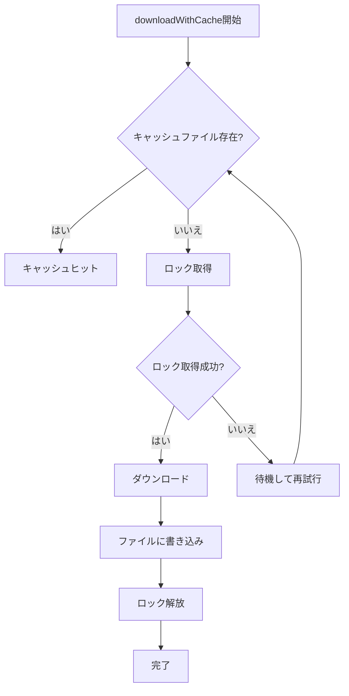
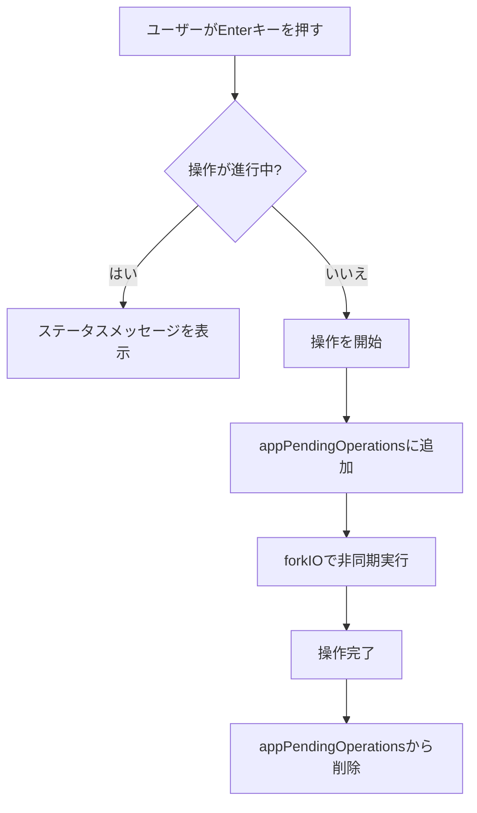

# マルチスレッドダウンロード競合状態の修正計画

## 問題の概要

ファイルのダウンロード中に同じファイルをダウンロードする操作が行われるマルチスレッド関連のバグが存在します。

## 特定された問題

### 1. ContentManager.downloadWithCache の競合状態（最も重要）

**場所**: [`ContentManager.hs:66-86`](../src/ContentManager.hs:66)

**問題**:
```haskell
downloadWithCache fs net cacheDir url onCacheHit onCacheMiss = do
    let fileName = takeFileName (T.unpack url)
    let cacheFilePath = cacheDir </> fileName

    fsdCreateDirectoryIfMissing fs True cacheDir

    cacheExists <- fsdDoesFileExist fs cacheFilePath  -- チェック
    if cacheExists
    then do
        onCacheHit
        return $ Right cacheFilePath
    else do
        onCacheMiss
        result <- ndDownloadFile net url  -- ダウンロード
        -- ... ファイルに書き込み
```

**競合状態**:
1. スレッドA: `fsdDoesFileExist` でキャッシュファイルの存在を確認 → 存在しない
2. スレッドB: `fsdDoesFileExist` でキャッシュファイルの存在を確認 → 存在しない
3. スレッドA: ダウンロード開始
4. スレッドB: ダウンロード開始（同じファイルを再度ダウンロード）

### 2. UI状態管理の欠如

**場所**: [`Types/UI.hs:49-68`](../src/Types/UI.hs:49)

**問題**: `AppState` にダウンロード中であることを示す状態がないため、ユーザーが連続してEnterキーを押すと同じ操作が複数回実行される。

### 3. イベントハンドラでのforkIO呼び出し

**場所**: 
- [`Events.Available.hs:59-63`](../src/Events/Available.hs:59)
- [`Events.App.hs:53-65`](../src/Events/App.hs:53)
- [`Events.Mod.AvailableHandler.hs:52-56`](../src/Events/Mod/AvailableHandler.hs:52)
- [`Events.Font.AvailableHandler.hs:37-43`](../src/Events/Font/AvailableHandler.hs:37)

**問題**: 各イベントハンドラが `forkIO` で新しいスレッドを作成しており、操作の重複を防ぐ仕組みがない。

---

## 修正案

### 修正案1: ファイルロックによる解決（推奨）

`downloadWithCache` 関数でファイルロックを使用して、同じファイルへの同時アクセスを防ぎます。

**メリット**:
- プロセス間でも安全
- 実装が比較的簡単
- 既存のコードへの影響が少ない

**デメリット**:
- ファイルロックの管理が必要
- デッドロックのリスク（適切に実装すれば回避可能）

**実装方針**:
1. `FileSystemDeps` にファイルロック用の関数を追加
2. `downloadWithCache` でロックを取得してからダウンロード
3. ロック取得中は他のスレッドは待機またはキャッシュヒットとして処理

### 修正案2: AppStateに進行中の操作を追跡するフィールドを追加

`AppState` に現在進行中のダウンロード/インストール操作を追跡するフィールドを追加します。

**メリット**:
- UIで進行中の操作を表示できる
- ユーザーにフィードバックを提供できる

**デメリット**:
- `AppState` の変更が他のモジュールに影響
- イベントハンドラの修正が必要

**実装方針**:
1. `AppState` に `appPendingOperations :: Set PendingOperation` を追加
2. 操作開始時にセットに追加、完了時に削除
3. イベントハンドラで操作が既に進行中かチェック

### 修正案3: MVarによる同期（Haskell的な解決策）

`MVar` を使用して、ダウンロード操作を同期します。

**メリット**:
- Haskellの標準的な同期機構
- 純粋なHaskellコード

**デメリット**:
- `IO` モナドが必要
- 依存性注入のパターンを変更する必要がある

---

## 推奨される修正アプローチ

### ステップ1: ファイルロックの実装（短期的な修正）



### ステップ2: AppStateへの進行中操作の追跡（中期的な修正）



---

## 実装の詳細

### 1. FileSystemHandleへのロック関数の追加

```haskell
-- Types/Handles/FileSystem.hs
data FileSystemHandle m = FileSystemHandle
    { -- 既存の関数...
    , hLockFile :: FilePath -> m (Either String ())
    , hUnlockFile :: FilePath -> m ()
    , hIsFileLocked :: FilePath -> m Bool
    }
```

### 2. downloadWithCacheの修正

```haskell
downloadWithCache fs net cacheDir url onCacheHit onCacheMiss = do
    let fileName = takeFileName (T.unpack url)
    let cacheFilePath = cacheDir </> fileName
    let lockFilePath = cacheFilePath <.> "lock"

    fsdCreateDirectoryIfMissing fs True cacheDir

    -- まずキャッシュをチェック
    cacheExists <- fsdDoesFileExist fs cacheFilePath
    if cacheExists
    then do
        onCacheHit
        return $ Right cacheFilePath
    else do
        -- ロックを取得
        lockResult <- fsdLockFile fs lockFilePath
        case lockResult of
            Left err -> return $ Left $ FileSystemError $ T.pack err
            Right () -> do
                -- ロック取得後、再度キャッシュをチェック（他のスレッドがダウンロード済みかもしれない）
                cacheExists' <- fsdDoesFileExist fs cacheFilePath
                if cacheExists'
                then do
                    fsdUnlockFile fs lockFilePath
                    onCacheHit
                    return $ Right cacheFilePath
                else do
                    onCacheMiss
                    result <- ndDownloadFile net url
                    case result of
                        Left e -> do
                            fsdUnlockFile fs lockFilePath
                            return $ Left e
                        Right responseBody -> do
                            writeResult <- try $ fsdWriteFile fs cacheFilePath (LBS.toStrict responseBody)
                            fsdUnlockFile fs lockFilePath
                            case writeResult of
                                Left (e :: SomeException) -> return $ Left $ FileSystemError $ T.pack $ show e
                                Right () -> return $ Right cacheFilePath
```

### 3. AppStateへの進行中操作の追跡

```haskell
-- Types/UI.hs
data PendingOperation 
    = DownloadingGame GameVersion
    | InstallingSoundpack SoundpackInfo
    | InstallingMod ModSourceInfo
    | InstallingFont FontInfo
    deriving (Eq, Show, Ord)

data AppState = AppState
    { -- 既存のフィールド...
    , appPendingOperations :: Set PendingOperation
    }
```

### 4. イベントハンドラの修正

```haskell
-- Events/Available.hs
handleAvailableEvents (V.EvKey V.KEnter []) = do
    st <- get
    case listSelectedElement (appAvailableVersions st) of
        Nothing -> return ()
        Just (_, gv) -> do
            let op = DownloadingGame gv
            if op `Set.member` appPendingOperations st
            then modify $ \s -> s { appStatus = "Already downloading " <> gvVersionId gv }
            else do
                modify $ \s -> s { appPendingOperations = Set.insert op (appPendingOperations s) }
                case getDownloadAction st of
                    Nothing -> return ()
                    Just action -> liftIO $ void $ forkIO action
```

---

## テスト計画

1. **単体テスト**: `downloadWithCache` の競合状態をテストする
2. **統合テスト**: 複数のスレッドから同時に同じファイルをダウンロードするシナリオをテストする
3. **手動テスト**: UIで連続してEnterキーを押した場合の動作を確認する

---

## 優先順位

1. **高**: `downloadWithCache` のファイルロック実装
2. **中**: `AppState` への進行中操作の追跡
3. **低**: イベントハンドラの修正（進行中操作の追跡の一部として実施）

---

## 影響範囲

- `src/ContentManager.hs`
- `src/Types/UI.hs`
- `src/Types/Handles/FileSystem.hs`
- `src/Handle.hs`
- `src/Events/Available.hs`
- `src/Events/App.hs`
- `src/Events/Mod/AvailableHandler.hs`
- `src/Events/Font/AvailableHandler.hs`
- `src/Soundpack/Deps.hs`
