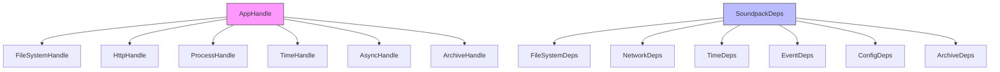

# Cataclysm Launcher Brick - Refactoring Analysis

## Overview

This document summarizes the refactoring opportunities identified in the codebase analysis.

---

## 1. Code Duplication Issues

### 1.1 `managerErrorToText` Function Duplicated

**Files affected:**
- [`app/Main.hs:42-50`](app/Main.hs:42) - `managerErrorToText`
- [`src/Events/App.hs:182-190`](src/Events/App.hs:182) - `managerErrorToText`
- [`src/Events/Installed.hs:39-47`](src/Events/Installed.hs:39) - `managerErrorToText`

**Problem:** The same function is defined in three different places with slight variations.

**Recommendation:** 
- Move to [`src/Types/Error.hs`](src/Types/Error.hs) as it's related to error types
- Export from `Types.Error` module
- Remove duplicates from other files

---

### 1.2 FileSystemDeps Construction Pattern

**Files affected:**
- [`src/Handle.hs:90-98`](src/Handle.hs:90) - `FileSystemDeps` construction
- [`src/Events/App.hs:39-47`](src/Events/App.hs:39) - `FileSystemDeps` construction
- [`src/GameManager/Install.hs:37-45`](src/GameManager/Install.hs:37) - `FileSystemDeps` construction

**Problem:** The same pattern of constructing `FileSystemDeps` from `AppHandle` is repeated in multiple places.

**Recommendation:**
- Create a helper function `toFileSystemDeps :: AppHandle m -> FileSystemDeps m`
- Place it in [`src/Soundpack/Deps.hs`](src/Soundpack/Deps.hs) or a dedicated conversion module

---

## 2. Dead Code and Unused Modules

### 2.1 Empty Module: `Soundpack/Common.hs`

**File:** [`src/Soundpack/Common.hs`](src/Soundpack/Common.hs)

**Problem:** This module is completely empty (only module declaration).

**Recommendation:** 
- Remove the file if not needed
- Or populate it with common soundpack utilities

---

### 2.2 Unused Typeclass: `SoundpackOperations`

**File:** [`src/Soundpack/Interface.hs`](src/Soundpack/Interface.hs)

**Problem:** The `SoundpackOperations` typeclass is defined but has no instances and is not used anywhere in the codebase.

**Recommendation:**
- Either implement instances and use it
- Or remove if the current handle pattern is sufficient

---

## 3. Inconsistent Abstraction Patterns

### 3.1 ModHandler Not Using Handle Pattern

**File:** [`src/ModHandler.hs`](src/ModHandler.hs)

**Problem:** 
- `enableMod` and `disableMod` functions use direct `IO` operations instead of `AppHandle`
- This breaks the dependency injection pattern used elsewhere
- Makes testing difficult

**Recommendation:**
- Refactor to use `AppHandle m` parameter like other modules
- Replace `System.Directory` calls with `FileSystemHandle` methods

---

### 3.2 BackupSystem Using Shell Command

**File:** [`src/BackupSystem.hs:75-82`](src/BackupSystem.hs:75)

**Problem:** Uses `hCallCommand` to execute shell `tar` command, which:
- Is platform-dependent
- Has potential shell injection vulnerabilities
- Is inconsistent with other archive handling

**Recommendation:**
- Use the same tar-conduit approach as [`src/ArchiveUtils.hs`](src/ArchiveUtils.hs)
- Or create a dedicated backup archiving function

---

## 4. Code Quality Issues

### 4.1 Duplicate Code in FontManager

**File:** [`src/FontManager.hs:179-184`](src/FontManager.hs:179)

**Problem:** The same code block is written twice:
```haskell
-- Write config
hWriteLazyByteString fs fontsJsonPath jsonContent
```

**Recommendation:** Remove the duplicate lines

---

### 4.2 filterM Redefinition

**File:** [`src/FontManager.hs:214-219`](src/FontManager.hs:214)

**Problem:** `filterM` is redefined locally when it's already available in `Control.Monad`

**Recommendation:** 
- Remove local definition
- Import `filterM` from `Control.Monad`

---

### 4.3 Unused Import Warning Suppression

**File:** [`src/Handle.hs:1`](src/Handle.hs:1)

**Problem:** Uses `{-# OPTIONS_GHC -Wno-unused-imports #-}` to suppress warnings

**Recommendation:** Clean up unused imports instead of suppressing warnings

---

## 5. Architectural Improvements

### 5.1 Two Parallel Handle Systems

**Problem:** 
- `AppHandle` in [`src/Types/Handle.hs`](src/Types/Handle.hs)
- `SoundpackDeps` in [`src/Soundpack/Deps.hs`](src/Soundpack/Deps.hs)

Both serve similar purposes (dependency injection) but have different structures.

**Recommendation:**
- Consider unifying into a single system
- Or document when to use each

---

### 5.2 Event Handler Organization

**Current structure:**
```
src/Events/
  App.hs
  Available.hs
  Backup.hs
  Fonts.hs
  Installed.hs
  List.hs
  Mods.hs
  Sandbox.hs
  Soundpack/
    CommonHandler.hs
    InstallHandler.hs
    ListHandler.hs
    UninstallHandler.hs
```

**Observation:** Soundpack handlers are well-organized in a subdirectory, but other handlers could benefit from similar organization.

---

## 6. Documentation Improvements

### 6.1 Missing Module Documentation

Several modules lack documentation headers:
- [`src/Events/Available.hs`](src/Events/Available.hs)
- [`src/Events/Fonts.hs`](src/Events/Fonts.hs)
- [`src/Events/Backup.hs`](src/Events/Backup.hs)
- [`src/GameManager.hs`](src/GameManager.hs)

**Recommendation:** Add documentation headers following the pattern in soundpack modules

---

## Priority Recommendations

### High Priority
1. Remove duplicate `managerErrorToText` functions
2. Fix duplicate code in `FontManager.configureSandboxForFont`
3. Remove `filterM` redefinition in `FontManager`

### Medium Priority
4. Create `toFileSystemDeps` helper function
5. Refactor `ModHandler` to use handle pattern
6. Remove or populate empty `Soundpack/Common.hs`

### Low Priority
7. Unify or document handle systems
8. Add missing module documentation
9. Clean up unused imports in `Handle.hs`

---

## Diagram: Current Handle Pattern Flow



---

## Next Steps

1. Review this analysis with the team
2. Prioritize which refactoring items to tackle first
3. Create individual task files for each refactoring item
4. Implement changes incrementally with tests