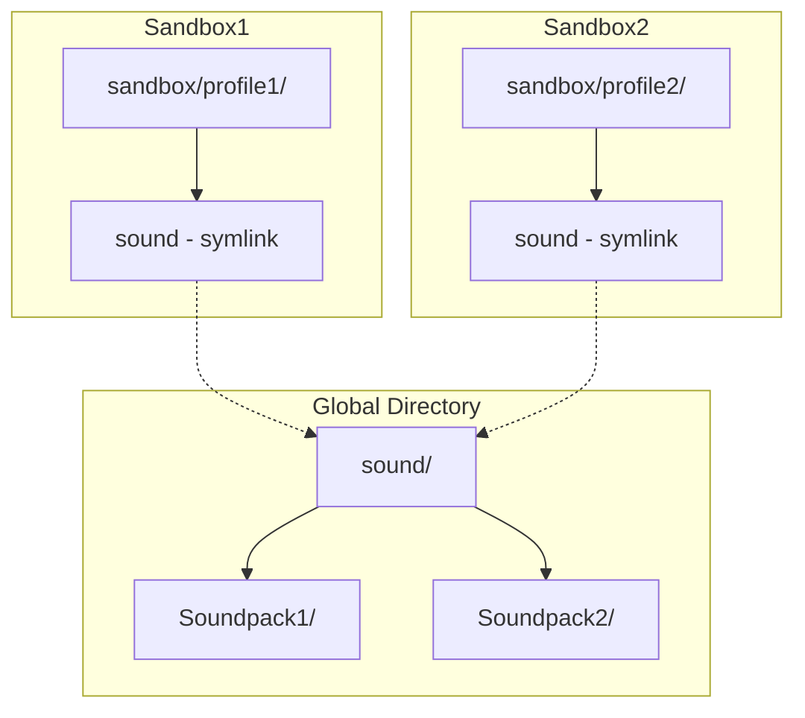

# Soundpack Global Installation Refactoring Plan

## Overview

This plan describes the refactoring of the soundpack installation feature to use a global directory with symbolic links to each sandbox, similar to the font implementation pattern.

## Current Implementation

### Font Pattern (Target Pattern)
- **Installation Directory**: `.cataclysm-launcher-brick/fonts/` (global)
- **Sandbox Link**: `sandbox/font` -> `.cataclysm-launcher-brick/fonts/` (symbolic link)
- **Created at**: Sandbox creation time via [`linkFontsDirToSandbox`](src/FontManager.hs:80)

### Current Soundpack Pattern (To Be Changed)
- **Installation Directory**: `sandbox/sound/` (per-sandbox)
- **Sandbox Link**: None (direct installation)
- **Created at**: Installation time

## Proposed Changes

### 1. New Global Soundpack Directory

Create a global soundpack directory at `.cataclysm-launcher-brick/sound/`:
- All soundpacks will be installed here
- Each soundpack will have its own subdirectory

### 2. Symbolic Link to Sandbox

Create symbolic link from each sandbox to the global soundpack directory:
- `sandbox/sound` -> `.cataclysm-launcher-brick/sound/`
- Created at sandbox creation time (similar to fonts)

### 3. Module Changes

#### [`Soundpack/Utils/Path.hs`](src/Soundpack/Utils/Path.hs:40)

```haskell
-- Current
getSoundpackDirectory :: FilePath -> FilePath
getSoundpackDirectory sandboxPath = sandboxPath </> "sound"

-- New (add function)
getGlobalSoundpackDirectory :: PathsConfig -> FilePath
getGlobalSoundpackDirectory pathsConfig = 
    T.unpack (launcherRoot pathsConfig) </> "sound"

-- Keep for backward compatibility (sandbox link path)
getSoundpackDirectory :: FilePath -> FilePath
getSoundpackDirectory sandboxPath = sandboxPath </> "sound"
```

#### [`Soundpack/Core.hs`](src/Soundpack/Core.hs:65)

Modify `processSoundpackInstall` to use global directory:

```haskell
-- Current
processSoundpackInstall :: SoundpackInfo -> SandboxProfile -> PathsConfig -> FeaturesConfig -> InstallPlan
processSoundpackInstall soundpackInfo profile pathsConfig featuresConfig =
  let downloadUrl = spiBrowserDownloadUrl soundpackInfo
      soundDir = getSoundpackDirectory (spDataDirectory profile)  -- sandbox/sound
      ...

-- New
processSoundpackInstall :: SoundpackInfo -> SandboxProfile -> PathsConfig -> FeaturesConfig -> InstallPlan
processSoundpackInstall soundpackInfo profile pathsConfig featuresConfig =
  let downloadUrl = spiBrowserDownloadUrl soundpackInfo
      soundDir = getGlobalSoundpackDirectory pathsConfig  -- .cataclysm-launcher-brick/sound
      ...
```

#### [`Soundpack/Install.hs`](src/Soundpack/Install.hs:66)

No major changes needed - the `InstallPlan` already contains the target directory.

#### [`Soundpack/List.hs`](src/Soundpack/List.hs:40)

Modify to list from global directory:

```haskell
-- Current
listInstalledSoundpacks :: Monad m => AppHandle m -> FilePath -> m [InstalledSoundpack]
listInstalledSoundpacks handle sandboxPath = do
  let soundDir = getSoundpackDirectory sandboxPath
  ...

-- New (add parameter for PathsConfig)
listInstalledSoundpacks :: Monad m => AppHandle m -> PathsConfig -> m [InstalledSoundpack]
listInstalledSoundpacks handle pathsConfig = do
  let soundDir = getGlobalSoundpackDirectory pathsConfig
  ...
```

#### [`Soundpack/Uninstall.hs`](src/Soundpack/Uninstall.hs:45)

Modify to uninstall from global directory:

```haskell
-- Current
uninstallSoundpack :: MonadCatch m => AppHandle m -> SandboxProfile -> InstalledSoundpack -> m (Either ManagerError ())
uninstallSoundpack handle profile installedSoundpack = do
    let sandboxPath = spDataDirectory profile
    let soundDir = getSoundpackDirectory sandboxPath
    ...

-- New
uninstallSoundpack :: MonadCatch m => AppHandle m -> PathsConfig -> InstalledSoundpack -> m (Either ManagerError ())
uninstallSoundpack handle pathsConfig installedSoundpack = do
    let soundDir = getGlobalSoundpackDirectory pathsConfig
    ...
```

#### New Module: `SoundpackManager.hs` (or add to existing)

Add `linkSoundpacksDirToSandbox` function similar to [`FontManager.linkFontsDirToSandbox`](src/FontManager.hs:80):

```haskell
-- | Links the global soundpacks directory to the sandbox's sound directory.
-- Creates a symlink: sandbox/sound -> .cataclysm-launcher-brick/sound
linkSoundpacksDirToSandbox :: (MonadCatch m)
                           => AppHandle m
                           -> SandboxProfile
                           -> PathsConfig
                           -> m (Either ManagerError ())
```

#### [`SandboxController.hs`](src/SandboxController.hs:79)

Add call to `linkSoundpacksDirToSandbox` in `createAndLaunchSandbox`:

```haskell
-- Current
-- Link fonts directory
let profile = SandboxProfile sandboxName sandboxPath
linkResult <- linkFontsDirToSandbox handle profile pathsConfig
...

-- New
-- Link fonts directory
let profile = SandboxProfile sandboxName sandboxPath
linkResult <- linkFontsDirToSandbox handle profile pathsConfig
...

-- Link soundpacks directory
linkSoundResult <- linkSoundpacksDirToSandbox handle profile pathsConfig
case linkSoundResult of
    Left err -> hWriteBChan (appAsyncHandle handle) eventChan $ ErrorEvent $ "Soundpack linking failed: " <> T.pack (show err)
    Right () -> return ()
```

#### [`Events/App.hs`](src/Events/App.hs:32)

Modify `InstallSoundpack` event handler to pass `PathsConfig` instead of `SandboxProfile`:

```haskell
-- Current
handleAppEvent (InstallSoundpack profile soundpackInfo) = do
    ...
    result <- installSoundpack deps profile soundpackInfo
    ...

-- New (profile may not be needed, or used only for UI feedback)
handleAppEvent (InstallSoundpack soundpackInfo) = do
    ...
    result <- installSoundpack deps pathsConfig soundpackInfo
    ...
```

### 4. Type Changes

#### [`Types/Event.hs`](src/Types/Event.hs)

```haskell
-- Current
data UIEvent = ...
  | InstallSoundpack SandboxProfile SoundpackInfo
  | ...

-- New (profile not needed for global installation)
data UIEvent = ...
  | InstallSoundpack SoundpackInfo
  | ...
```

### 5. Test Updates

- [`test/SoundpackManagerSpec.hs`](test/SoundpackManagerSpec.hs) - Update to use global directory
- [`test/Integration/FontLinkingSpec.hs`](test/Integration/FontLinkingSpec.hs) - Add similar test for soundpack linking
- [`test/Soundpack/InstallSpec.hs`](test/Soundpack/InstallSpec.hs) - Update installation tests

## Architecture Diagram



## Implementation Order

1. **Add new path functions** in `Soundpack/Utils/Path.hs`
2. **Add `linkSoundpacksDirToSandbox`** function
3. **Modify `Soundpack/Core.hs`** to use global directory
4. **Modify `Soundpack/List.hs`** to list from global directory
5. **Modify `Soundpack/Uninstall.hs`** to uninstall from global directory
6. **Modify `SandboxController.hs`** to call `linkSoundpacksDirToSandbox`
7. **Update event handlers** in `Events/App.hs`
8. **Update tests**

## Benefits

1. **Disk Space**: Soundpacks are stored once, not duplicated per sandbox
2. **Consistency**: Same pattern as fonts
3. **Maintenance**: Easier to manage installed soundpacks
4. **Installation Speed**: No need to reinstall for each sandbox

## Migration Considerations

- Existing sandboxes with soundpacks installed directly may need migration
- Consider adding migration logic to move existing soundpacks to global directory
- Or document that users need to reinstall soundpacks after update