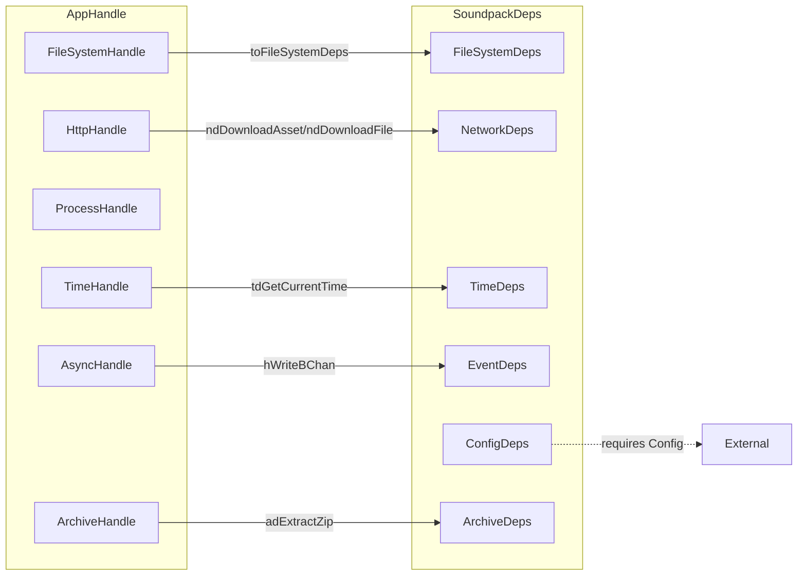
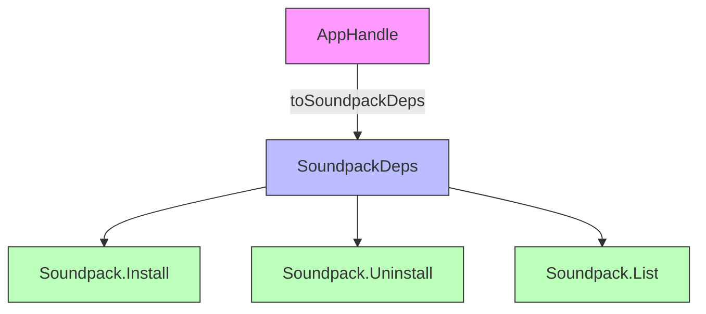

# Two Parallel Handle Systems - Unification Plan

## Overview

This document describes the plan to unify the two parallel handle systems (`AppHandle` and `SoundpackDeps`) by implementing a conversion function.

## Current State Analysis

### AppHandle Structure

Location: [`src/Types/Handle.hs`](src/Types/Handle.hs)

```haskell
data AppHandle m = AppHandle
    { appFileSystemHandle :: FileSystemHandle m
    , appHttpHandle       :: HttpHandle m
    , appProcessHandle    :: ProcessHandle m
    , appTimeHandle       :: TimeHandle m
    , appAsyncHandle      :: AsyncHandle m
    , appArchiveHandle    :: ArchiveHandle m
    }
```

### SoundpackDeps Structure

Location: [`src/Soundpack/Deps.hs`](src/Soundpack/Deps.hs)

```haskell
data SoundpackDeps m = SoundpackDeps
  { spdFileSystem :: FileSystemDeps m
  , spdNetwork    :: NetworkDeps m
  , spdTime       :: TimeDeps m
  , spdEvents     :: EventDeps m
  , spdConfig     :: ConfigDeps m
  , spdArchive    :: ArchiveDeps m
  }
```

### Mapping Relationship



## Problem Statement

In [`src/Events/App.hs:38-54`](src/Events/App.hs:38), `SoundpackDeps` is manually constructed each time:

```haskell
let fsDeps = toFileSystemDeps (appFileSystemHandle handle)
let netDeps = NetworkDeps
      { ndDownloadAsset = hDownloadAsset (appHttpHandle handle)
      , ndDownloadFile = hDownloadFile (appHttpHandle handle)
      }
let timeDeps = TimeDeps { tdGetCurrentTime = hGetCurrentTime (appTimeHandle handle) }
let eventDeps = EventDeps { edWriteEvent = writeBChan chan }
let configDeps = ConfigDeps { cdGetConfig = return (appConfig st) }
let archiveDeps = ArchiveDeps
      { adExtractZip = \installDir zipData -> do
          result <- hExtractZip (appArchiveHandle handle) (appFileSystemHandle handle) installDir zipData
          return $ case result of
            Left err -> Left (show err)
            Right _ -> Right ()
      }
let deps = SoundpackDeps fsDeps netDeps timeDeps eventDeps configDeps archiveDeps
```

This pattern is error-prone and duplicates code.

## Solution: Conversion Function

### New Function Signature

Add to [`src/Soundpack/Deps.hs`](src/Soundpack/Deps.hs):

```haskell
-- | Convert AppHandle to SoundpackDeps.
-- This function eliminates code duplication when constructing SoundpackDeps.
-- 
-- Parameters:
--   handle   - The AppHandle containing all handles
--   chan     - The event channel for UI events
--   config   - The application configuration
--
-- Returns:
--   SoundpackDeps ready for use in soundpack operations
toSoundpackDeps :: AppHandle m -> BChan UIEvent -> Config -> SoundpackDeps m
```

### Implementation Details

```haskell
toSoundpackDeps :: AppHandle m -> BChan UIEvent -> Config -> SoundpackDeps m
toSoundpackDeps handle chan config = SoundpackDeps
    { spdFileSystem = toFileSystemDeps (appFileSystemHandle handle)
    , spdNetwork = NetworkDeps
        { ndDownloadAsset = hDownloadAsset (appHttpHandle handle)
        , ndDownloadFile = hDownloadFile (appHttpHandle handle)
        }
    , spdTime = TimeDeps
        { tdGetCurrentTime = hGetCurrentTime (appTimeHandle handle)
        }
    , spdEvents = EventDeps
        { edWriteEvent = writeBChan chan
        }
    , spdConfig = ConfigDeps
        { cdGetConfig = return config
        }
    , spdArchive = ArchiveDeps
        { adExtractZip = \installDir zipData -> do
            result <- hExtractZip (appArchiveHandle handle) (appFileSystemHandle handle) installDir zipData
            return $ case result of
                Left err -> Left (show err)
                Right _ -> Right ()
        }
    }
```

## Implementation Steps

### Step 1: Add Conversion Function

- [ ] Add `toSoundpackDeps` function to [`src/Soundpack/Deps.hs`](src/Soundpack/Deps.hs)
- [ ] Add necessary imports:
  - `Brick.BChan (BChan, writeBChan)`
  - `Types.Event (UIEvent)`
  - `Types.Domain (Config)`
  - `Types.Handle (AppHandle(..))`

### Step 2: Update Events/App.hs

- [ ] Replace manual construction with `toSoundpackDeps` call
- [ ] Update imports to use the new function

### Step 3: Update Exports

- [ ] Export `toSoundpackDeps` from [`src/Soundpack/Deps.hs`](src/Soundpack/Deps.hs)

### Step 4: Testing

- [ ] Run existing tests to ensure no regression
- [ ] Verify soundpack installation still works

## Files to Modify

| File | Changes |
|------|---------|
| [`src/Soundpack/Deps.hs`](src/Soundpack/Deps.hs) | Add `toSoundpackDeps` function and exports |
| [`src/Events/App.hs`](src/Events/App.hs) | Replace manual construction with conversion function |

## Benefits

1. **Reduced Code Duplication**: Single source of truth for conversion logic
2. **Easier Maintenance**: Changes to handle structure only need updates in one place
3. **Better Documentation**: Clear relationship between the two systems
4. **Type Safety**: Compiler ensures all dependencies are provided

## Future Considerations

After this refactoring, consider:

1. **Gradual Migration**: Other modules using `AppHandle` directly for soundpack operations could be updated to use `SoundpackDeps`
2. **Full Unification**: Eventually, `SoundpackDeps` could be deprecated in favor of `AppHandle` with additional fields
3. **Documentation**: Add module documentation explaining when to use each system

## Diagram: After Refactoring


