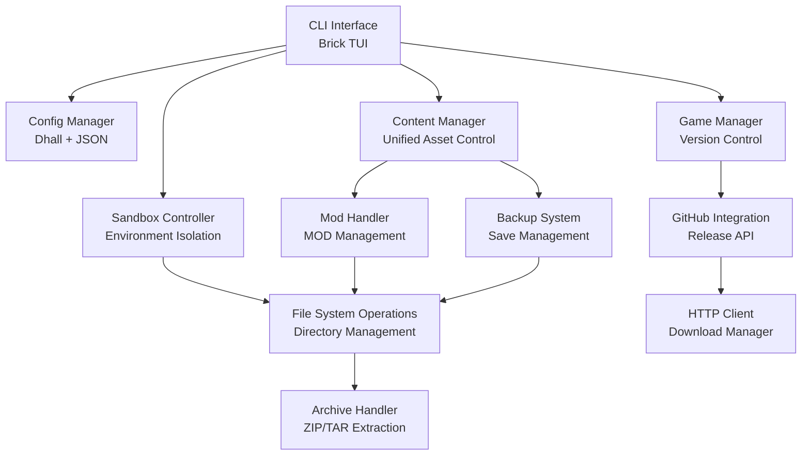
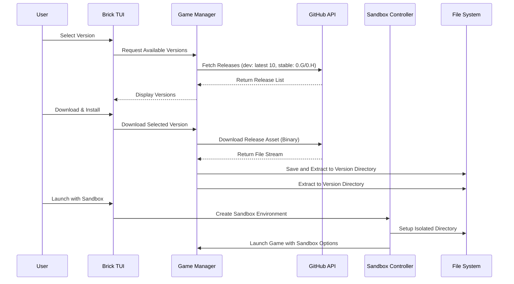
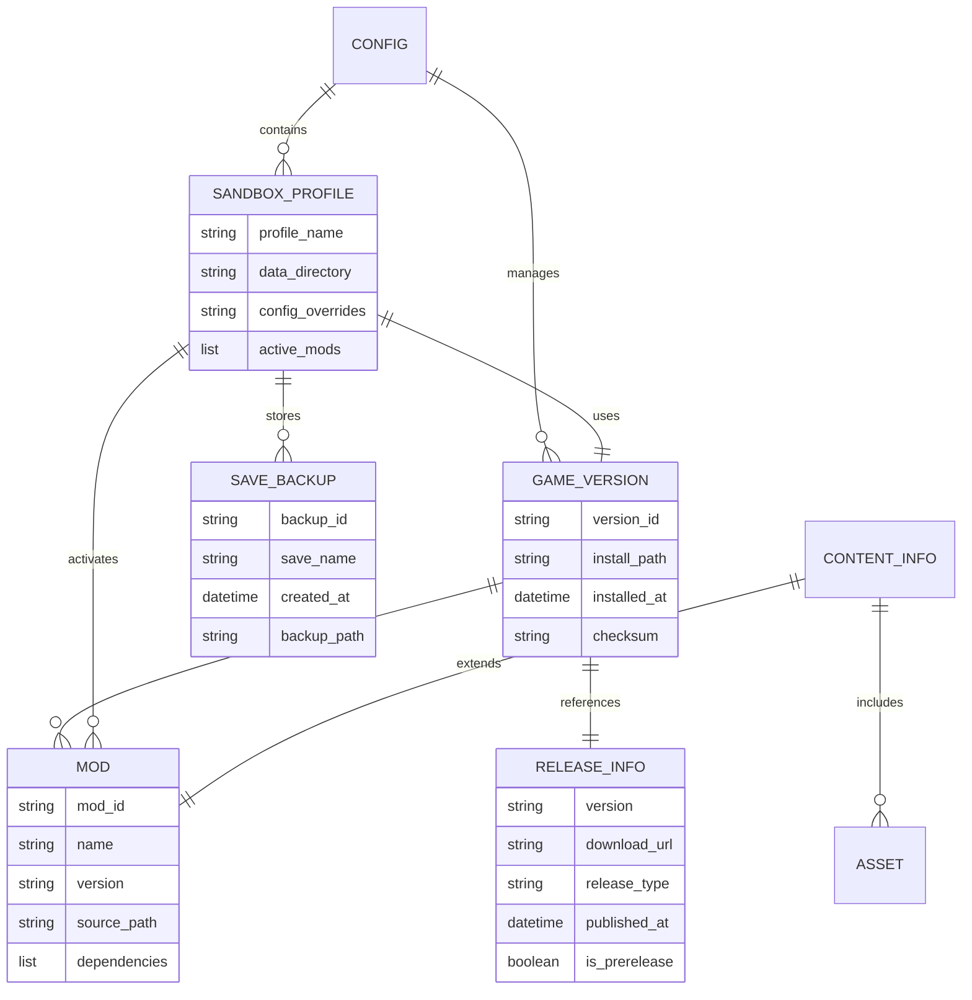

## 1. Overview
Cataclysm: Dark Days Ahead向けCLIランチャーの開発。GitHub リリースから開発版(最新10件)・安定版(0.G/0.H系)をダウンロード・実行する統合管理ツール。Brickライブラリを使用したターミナルベースのインターフェースで、ゲーム管理、サンドボックスシステム、コンテンツ管理、バックアップシステム、設定管理を一元化。

## 2. Context
- GitHub リリースページからの自動バージョン取得・ダウンロードの自動化
- 複数バージョンの同時インストール管理による開発・テストの効率化
- サンドボックス環境による安全な実験とデータ分離
- MOD・アセット管理の煩雑さ解消とユーザビリティ向上
- セーブデータの安全なバックアップ・復元システム

## 3. Scope
**主要ファイル:**
- `app/Main.hs` (エントリポイント・TUI管理)
- `src/Config.hs` (設定管理・Dhall設定)
- `src/GameManager.hs` (バージョン管理・起動制御)
- `src/SandboxController.hs` (サンドボックス操作・環境分離)
- `src/ModHandler.hs` (MOD・アセット管理)
- `src/BackupSystem.hs` (セーブデータバックアップ)
- `src/GitHubIntegration.hs` (GitHub API連携・リリース取得)
- `src/ContentManager.hs` (コンテンツ統合管理)
- `test/IntegrationSpec.hs` (統合テスト)
- `config/launcher.dhall` (デフォルト設定ファイル、`~/.cataclysm-launcher-brick/config.dhall` に配置)

## 4. Goal
- GitHub API連携による自動バージョン管理（開発版最新10件 + 安定版対応）
- サンドボックス環境での安全なゲーム実行
- MOD・アセット・セーブデータの完全管理
- テストカバレッジ80%以上達成
- 主要機能のE2Eテストケース15件以上作成

## 5. Non-Goal
- GUI版の開発
- 自動更新機能（手動ダウンロードのみ）
- クラウド同期機能
- ゲーム内設定の直接編集
- リアルタイムマルチプレイヤー対応

## 6. Solution / Technical Architecture

### ディレクトリ構造
ランチャーは、すべての関連データを一元的に管理するため、以下のディレクトリ構造を使用します。ベースディレクトリはデフォルトで `~/.cataclysm-launcher-brick/` です。

```
~/.cataclysm-launcher-brick/
├── config.dhall          # ランチャー設定ファイル
├── cache/                # ダウンロードしたアーカイブ（.zip, .tar.gz）のキャッシュ
|
├── sys-repo/             # ランチャーが自動的にダウンロード・管理するリポジトリ
│   ├── game/             # 展開済みのゲームバージョン
│   │   └── <version_id>/ # e.g., 0.G-stable, 2025-06-17-0800-experimental
│   ├── mods/             # ランチャー経由でインストールしたMOD
│   ├── soundpacks/       # ランチャー経由でインストールしたサウンドパック
│   └── tilesets/         # ランチャー経由でインストールしたタイルセット
|
├── user-repo/            # ユーザーが手動で配置・管理するためのリポジトリ
│   ├── game/             # ユーザーが手動で配置したゲームバージョン
│   ├── mods/             # ユーザーが手動で配置したMOD
│   ├── soundpacks/       # (同様)
│   └── tilesets/         # (同様)
|
├── sandbox/              # 各サンドボックス環境のデータディレクトリ
│   └── <profile_name>/   # プロファイルごとのセーブデータ、設定、MOD構成
|
└── backups/              # セーブデータのバックアップ
    └── <profile_name>/   # プロファイルごとのバックアップ
```
この構造により、ランチャー管理のアセットとユーザー管理のアセットが明確に分離され、安全な運用が可能になります。

### システム全体構成


### データフロー


### データモデル


## 7. Detailed Feature Specifications

### 7.1 ゲーム管理 (GameManager)
**機能詳細:**
- GitHub Releases APIから開発版（最新10件のpre-release）と安定版（0.G, 0.H系のrelease）を取得
- バージョン別ディレクトリ（`sys-repo/game/<バージョンID>`）での並行インストール管理
- `user-repo/game/` にユーザーが手動で配置したバージョンも認識
- ダウンロードしたアーカイブは `cache/` ディレクトリに保存
- ダウンロード進捗表示とチェックサム検証
- ゲーム起動時のコマンドライン引数制御

**実装方針:**
```haskell
data ReleaseType = Development | Stable deriving (Show, Eq)
data GameVersion = GameVersion
  { gvVersion :: Text
  , gvReleaseType :: ReleaseType
  , gvDownloadUrl :: Text
  , gvInstallPath :: FilePath
  , gvChecksum :: Maybe Text
  } deriving (Show, Eq)
```

### 7.2 サンドボックスシステム (SandboxController)
**機能詳細:**
- プロファイル別の隔離ディレクトリ作成（`sandbox/<プロファイル名>/`）
- ゲーム実行時の `--userdir` オプションをサンドボックスのパスに自動指定
- 設定ファイル・セーブデータ・MODの分離管理
- サンドボックス間でのデータコピー・移行

**実装方針:**
```haskell
data SandboxProfile = SandboxProfile
  { spName :: Text
  , spDataDirectory :: FilePath
  , spGameVersion :: GameVersion
  , spActiveMods :: [ModInfo]
  , spConfigOverrides :: Map Text Value
  } deriving (Show, Eq)
```

### 7.3 コンテンツ管理 (ContentManager + ModHandler)
**機能詳細:**
- MOD・サウンドパック・フォント等の統合管理。`sys-repo`（ランチャー管理）と`user-repo`（ユーザー管理）の両方をスキャンし、利用可能な全コンテンツのリストを生成する
- **優先順位**: `user-repo` 内のアセットは、`sys-repo` 内に同名のものが存在する場合、それをオーバーライドする
- 依存関係解決と互換性チェック
- アセットの自動インストール・更新（`sys-repo` 内に配置）
- コンテンツパックのバージョン管理

`ContentManager`は、MOD、サウンドパック、セーブデータといったユーザーが管理する「コンテンツ」全般を扱う統一的なインターフェースを提供する。
具体的なMODの依存関係解決やインストール処理は`ModHandler`が、
セーブデータのバックアップ・復元処理は`BackupSystem`がそれぞれ担当し、
`ContentManager`はこれらのモジュールを協調させて動作させる責務を持つ。

**実装方針:**
```haskell
data ContentType = Mod | SoundPack | Font | Tileset deriving (Show, Eq)
data ContentInfo = ContentInfo
  { ciId :: Text
  , ciName :: Text
  , ciType :: ContentType
  , ciVersion :: Text
  , ciDependencies :: [Text]
  , ciSourcePath :: FilePath
  } deriving (Show, Eq)
```

### 7.4 バックアップシステム (BackupSystem)
**機能詳細:**
- `backups/<プロファイル名>/` 以下へのセーブデータの自動・手動バックアップ
- 世代管理とローテーション
- バックアップの圧縮・展開
- 復元前のプレビュー機能

**実装方針:**
```haskell
data BackupInfo = BackupInfo
  { biId :: Text
  , biSaveName :: Text
  , biCreatedAt :: UTCTime
  , biBackupPath :: FilePath
  , biGameVersion :: Text
  , biSize :: Integer
  } deriving (Show, Eq)
```

### 7.5 設定管理 (Config)
**機能詳細:**
- Dhallによる型安全な設定管理
- ランチャー設定とゲーム設定の分離
- プロファイル別設定オーバーライド
- 設定の検証とデフォルト値適用

**設定ファイル例 (config/launcher.dhall):**
```dhall
-- config/launcher.dhall の推奨される内容
-- 各ディレクトリパスは launcherRootDirectory を基準に自動生成されるため、
-- ユーザーは基本的にこのルートディレクトリのみを意識すれば良い。
let home = env:HOME ? "/home/user"
let launcherRoot = home ++ "/.cataclysm-launcher-brick"

in {
  -- 主要なディレクトリパス。必要に応じて個別に上書き可能。
  , launcherRootDirectory = launcherRoot
  , cacheDirectory = launcherRoot ++ "/cache"
  , sysRepoDirectory = launcherRoot ++ "/sys-repo"
  , userRepoDirectory = launcherRoot ++ "/user-repo"
  , sandboxDirectory = launcherRoot ++ "/sandbox"
  , backupDirectory = launcherRoot ++ "/backups"

  -- その他の設定
  , maxBackupCount = 10
  , githubApiUrl = "https://api.github.com/repos/CleverRaven/Cataclysm-DDA/releases"
  , downloadThreads = 4
  , logLevel = "Info"
}
```

## 8. Alternative Solutions

### 8.1 GUI実装案
**Pros:** 直感的な操作、ファイルブラウザ統合  
**Cons:** 開発コスト増、依存関係複雑化、リソース使用量増加  
**判定:** CLI版完成後の将来課題

### 8.2 Docker/Podman サンドボックス案
**Pros:** 完全な環境隔離、セキュリティ向上  
**Cons:** 複雑性増加、パフォーマンス低下、依存関係増加  
**判定:** 現在の要件には過剰、ディレクトリ分離で十分

### 8.3 データベース使用案 (SQLite)
**Pros:** 複雑なクエリ対応、データ整合性  
**Cons:** 設定の可読性低下、バックアップ複雑化  
**判定:** DhallとJSONで十分、将来的な検討課題

## 9. Concerns

### 9.1 技術的リスク
- **GitHub APIレートリミット**: 認証なしで60req/hour制限
  - 対策: レスポンスキャッシュ、リクエスト間隔制御、加えて、Dhall設定ファイルで任意にGitHub Personal Access Tokenを設定可能にし、認証済みリクエスト（5000req/hour）を利用するオプションを提供。
- **大容量ファイルダウンロード**: ゲームサイズ100MB前後
  - 対策: 進捗表示
- **クロスプラットフォーム互換性**: Windows/Linux/macOSでのパス処理
  - 対策: `filepath`ライブラリ使用、テスト環境での検証

### 9.2 運用リスク
- **MOD依存関係の複雑化**: 相互依存・競合の管理
  - 対策: 依存関係グラフ構築、競合検出アルゴリズム
- **セーブデータ互換性**: バージョン間でのセーブ形式変更
  - 対策: バージョン情報付きバックアップ、復元前警告
- **ディスク容量不足**: 複数バージョン・バックアップでの容量圧迫
  - 対策: 容量監視、自動クリーンアップ、ユーザー警告

## 10. Safety and Reliability

### 10.1 テスト戦略
- **ユニットテスト**: 純粋関数の動作検証（Hspec + QuickCheck）
- **統合テスト**: API連携・ファイル操作の検証（Hspec）
- **プロパティテスト**: 設定パース・バックアップ処理の網羅検証（Hedgehog）
- **E2Eテスト**: 実際のGitHub APIを使用したフルシナリオテスト

### 10.2 エラーハンドリング
```haskell
data LauncherError
  = NetworkError Text
  | FileSystemError FilePath Text
  | ParseError Text
  | GameLaunchError Text
  | BackupError Text
  deriving (Show, Eq)
```

### 10.3 データ保護
- **原子的操作**: ファイル操作の途中失敗時のロールバック
- **バックアップ検証**: 作成後のデータ整合性チェック
- **設定検証**: Dhall型システムによる設定値検証
- **権限管理**: 最小権限での実行、危険操作の確認ダイアログ

### 10.4 ログ・監視
```haskell
-- Katip構造化ログ使用例
logGameLaunch :: GameVersion -> SandboxProfile -> KatipT IO ()
logGameLaunch gv sp = $(logTM) InfoS $ ls "Game launched" 
  <> "version" .= gvVersion gv 
  <> "sandbox" .= spName sp
```

## 11. Implementation Phases

### Phase 1: Core Infrastructure (Week 1-2)
- [ ] プロジェクト構造設定
- [ ] 基本設定管理 (Dhall)
- [ ] GitHub API連携基盤
- [ ] 基本TUI実装

### Phase 2: Game Management (Week 3-4)
- [ ] リリース取得・表示
- [ ] ダウンロード・インストール
- [ ] バージョン管理
- [ ] 基本ゲーム起動

### Phase 3: Sandbox System (Week 5-6)
- [ ] サンドボックス作成・管理
- [ ] プロファイル切り替え
- [ ] 隔離実行システム

### Phase 4: Content & Backup (Week 7-8)
- [ ] MOD管理システム
- [ ] バックアップ・復元
- [ ] 統合テスト
- [ ] ドキュメント整備

## 12. References
- [Cataclysm:DDA 公式リポジトリ](https://github.com/CleverRaven/Cataclysm-DDA)
- [GitHub Releases API](https://docs.github.com/en/rest/releases/releases)
- [Brick Tutorial](https://github.com/jtdaugherty/brick/blob/master/docs/guide.rst) 
- [Dhall 言語ガイド](https://docs.dhall-lang.org/)
- [Haskell Stack LTS 22.44](https://www.stackage.org/lts-22.44)
